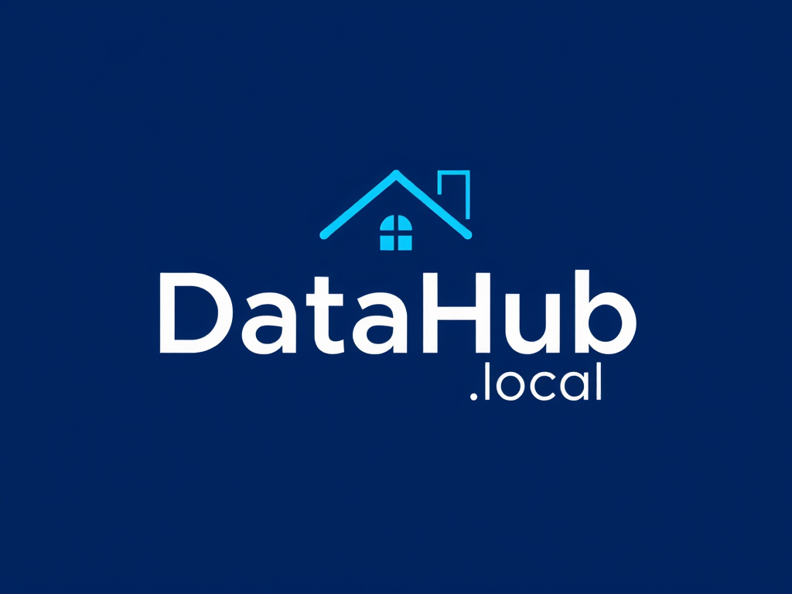

# DataHub.local

{ align=right width="40%" }

DataHub.local is a home laboratory that will enable you to create an complete data platform like [Snowflake](https://www.snowflake.com/) but that could run in low-end devices such as RaspberryPi, or OrangePi at home.

As a home laboratory its main personal benefits are:

- **Hands-On Experience**
- **Experimentation and Innovation**
- **Problem-Solving Skills**
- **Portfolio Development**
- **Self-Directed Learning**
- **Understanding of Hardware and Networking**
- **Passion and Motivation**

## Goals

- Deploy and maintain a general purpose architecture based on Kubernetes.
- Implement the lastest Devops pratices to automate the building, testing, and deployment of software.
- Incorporate monitoring and security tools to track the performance of software and identify potential issues of any kind.
- Desing and implement a scalable system that allows for the efficient collection, storage, processing, and analysis of Data.

## What have I achevied until today?

- ???
- ???
- ???

## Contributing

We welcome contributions! Read the [contribution guidelines](CONTRIBUTING.md) for details.

## License

This project is licensed under the [Apache License](LICENSE).