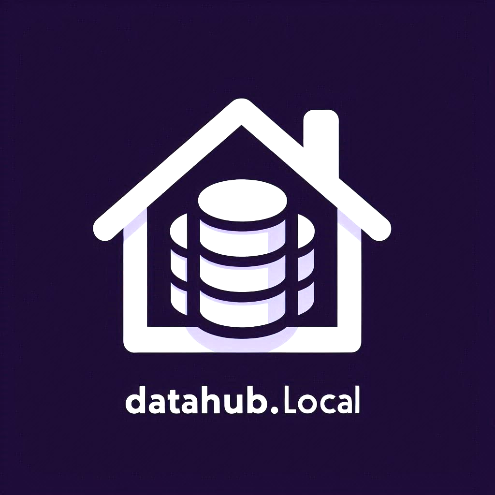

# DataHub.local

DataHub.local is a home laboratory that will enable you to create an complete data platform like [Snowflake](https://www.snowflake.com/) but that could run in low-end devices such as RaspberryPi, or OrangePi at home.

## Contributing

We welcome contributions! Read the [contribution guidelines](CONTRIBUTING.md) for details.

## License

This project is licensed under the [Apache License](LICENSE).