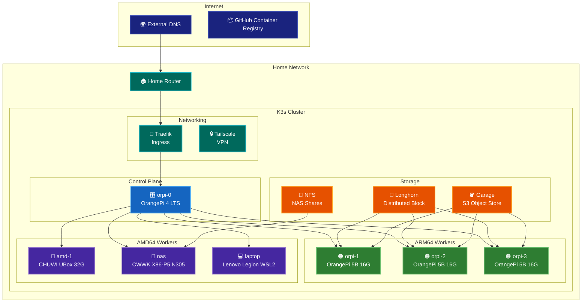
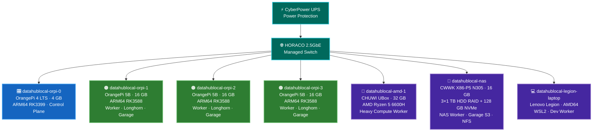
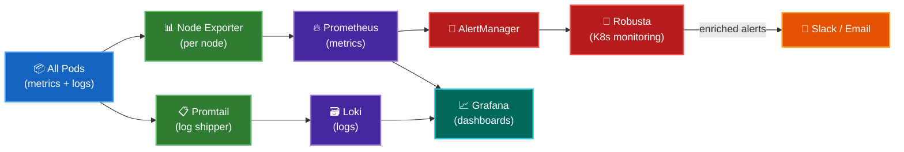
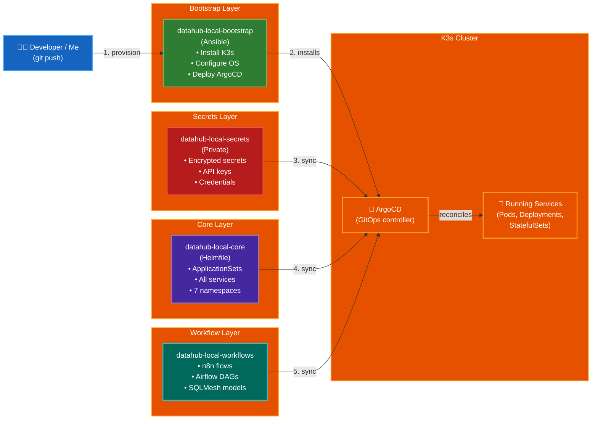

# Architecture Overview

This page describes the logical and physical cluster architecture, storage design, observability, and the GitOps deployment pipeline that powers DataHub.local.

---

## General

High-level view of the cluster: how nodes, networking, and storage components relate to each other.

---

## Physical Layout

The cluster is a **heterogeneous mix of ARM64 and AMD64** machines — an OrangePi SBC for the control plane, OrangePi 5B boards as initial workers, and x86 mini-PCs that have progressively replaced them for better performance-per-euro.

### Cluster Nodes

| Node | Hardware | Role | CPU Arch | OS |
|------|----------|------|----------|----|
| `datahublocal-orpi-0` | OrangePi 4 LTS (4 GB) | Control Plane | ARM64 (RK3399) | Debian 13 |
| `datahublocal-orpi-1` | OrangePi 5B (16 GB) | Worker | ARM64 (RK3588) | Debian 13 |
| `datahublocal-orpi-2` | OrangePi 5B (16 GB) | Worker | ARM64 (RK3588) | Debian 13 |
| `datahublocal-orpi-3` | OrangePi 5B (16 GB) | Worker | ARM64 (RK3588) | Debian 13 |
| `datahublocal-amd-1` | CHUWI UBox (AMD 6600H, 32 GB) | Worker | AMD64 | Debian 13 |
| `datahublocal-nas` | CWWK X86-P5 (N305, 16 GB, RAID 3×1TB + 128 GB NVMe) | NAS + Worker | AMD64 | Debian 12 |
| `datahublocal-legion-laptop` | Lenovo Legion laptop | Dev + Worker | AMD64 (WSL2) | Ubuntu 24.04 |

**Kubernetes distribution:** K3s v1.36 (lightweight, production-ready)  
**Container runtime:** containerd 2.2

> **Architecture evolution:** The cluster started ARM-only with OrangePi 5B boards, but over time x86 mini-PCs proved significantly more cost-effective for compute-heavy workloads (Spark, Trino). The ARM nodes remain useful for lightweight services and multi-arch testing — see [Lessons Learned](../lessons-learned.md) for more context.

---

## Namespace Layout

Services are organized into **namespaces by concern**, each managed as a separate ArgoCD Application:

| Namespace | Contents |
|-----------|----------|
| `kube-system` | K3s system components, Traefik, Longhorn CSI, cert-manager, ExternalDNS, reloader, reflector, snapshot-controller, NVIDIA plugin |
| `automation` | ArgoCD, n8n, Velero, Kopia backup agents |
| `data` | Airflow, Trino, Superset, Redpanda, Nessie, Spark, PostgreSQL, Garage, Ollama, Open WebUI, Valkey |
| `monitoring` | Prometheus, AlertManager, Grafana, Loki, Promtail, Robusta, Speedtest exporter |
| `security` | cert-manager, Dex (OIDC), OAuth2-proxy, Tailscale |
| `media` | CommaFeed (RSS), MusicGrabber |
| `other` | Homepage dashboard, ConvertX, IT Tools, Mazanoke, Omni Tools, Stirling PDF |

---

## Networking & Access

| Method | Use Case |
|--------|----------|
| **Traefik IngressRoutes** | Internal HTTP/HTTPS routing for all web UIs (Grafana, Superset, ArgoCD, etc.) |
| **Tailscale VPN** | Secure remote access from anywhere — no port forwarding needed |
| **ExternalDNS** | Automatically manages DNS records for exposed services |
| **cert-manager** | Automatic TLS certificates via Let's Encrypt |
| **OAuth2-proxy + Dex** | SSO authentication for all web services using OIDC |

---

## Storage

Storage is split by access pattern and cost profile — fast NVMe for latency-sensitive workloads, spinning HDD RAID for bulk data that doesn't need IOPS.

| Tier | Technology | Backing hardware | Use case |
|------|-----------|-----------------|----------|
| **High-performance block** | Longhorn | NVMe SSDs on OrangePi 5B nodes | Stateful apps that need low latency: PostgreSQL, Redpanda, Valkey — replicated across nodes for HA |
| **High-capacity object (S3)** | Garage | NVMe SSD on CWWK NAS | Data lake (Iceberg tables, Spark outputs, Loki logs, backups) — fast random reads for analytics workloads without the cost of full NVMe replicas across every node |
| **Bulk shared filesystem** | NFS (CWWK NAS RAID) | 3×1 TB HDD RAID | Large sequential files: media library, raw data exports, archives — big and cheap, latency-tolerant |

> **Design principle:** Put the _right_ data on the _right_ storage. Longhorn replicas on NVMe make PostgreSQL snappy; Garage on a single NVMe NAS node is fast enough for object storage at a fraction of the cost; HDD RAID covers everything that just needs capacity.

---

## Observability

All services expose Prometheus metrics via `ServiceMonitor` resources. Logs are shipped via Promtail to Loki. Alerts flow from Prometheus AlertManager to notification channels.

---

## GitOps

Everything in the cluster is managed as code. No manual `kubectl apply` for services — all changes flow through Git.

### Deployment Flow

1. **Bootstrap** — Ansible provisions OS on bare metal, installs K3s, and deploys ArgoCD as the first application.
2. **Secrets** — ArgoCD syncs `datahub-local-secrets` (private repo) to deploy encrypted secrets into the `security` namespace.
3. **Core** — ArgoCD syncs `datahub-local-core`, which contains Helmfile-based ApplicationSets that expand into one Application per namespace × service.
4. **Workflows** — n8n flow JSONs, Airflow DAG Python files, and SQLMesh models are synced from `datahub-local-workflows`.
5. **Reconciliation** — ArgoCD continuously watches all repos and auto-syncs on any commit to `HEAD`.
