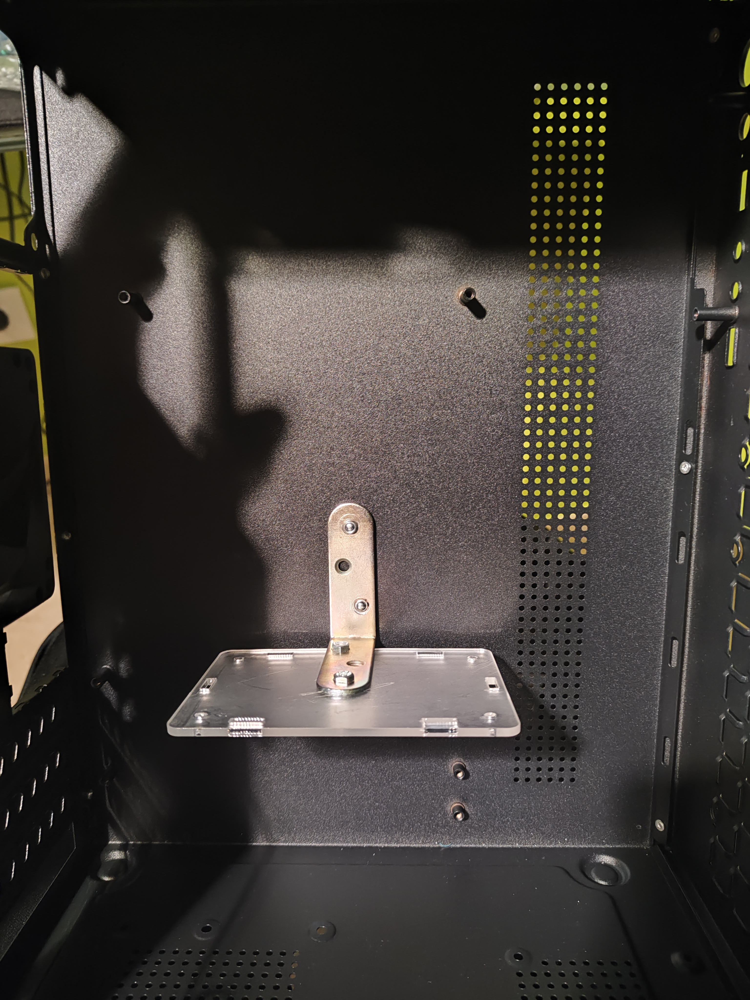
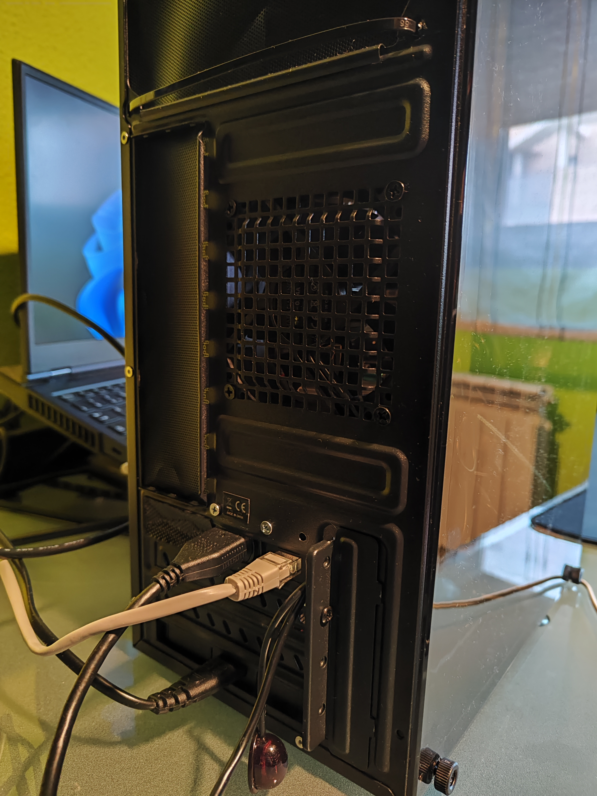
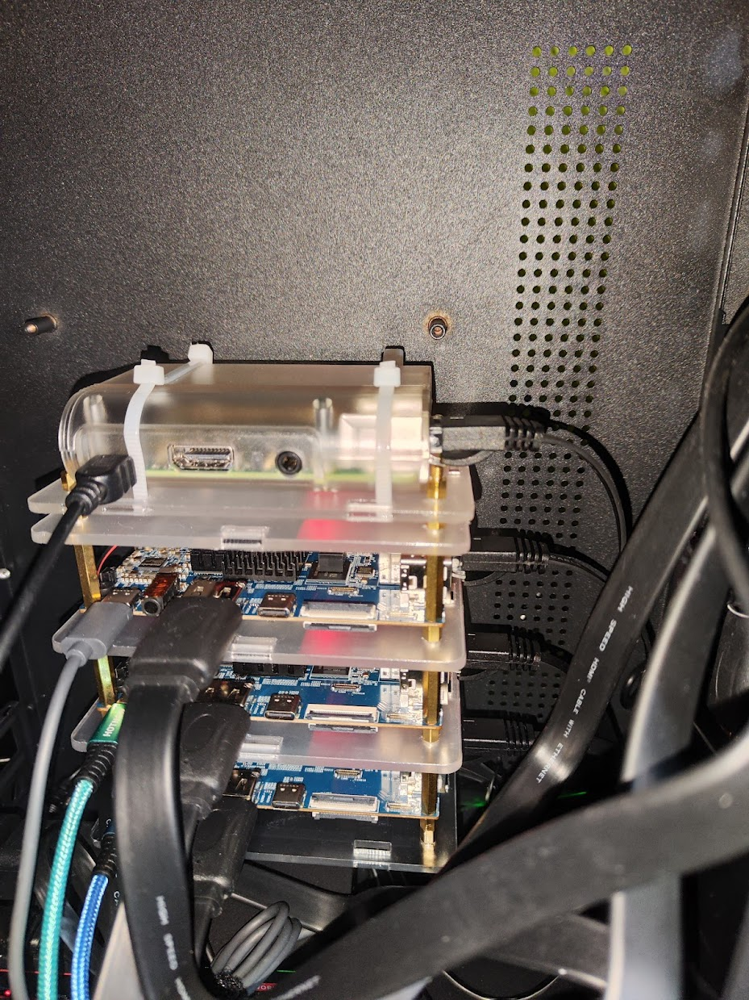
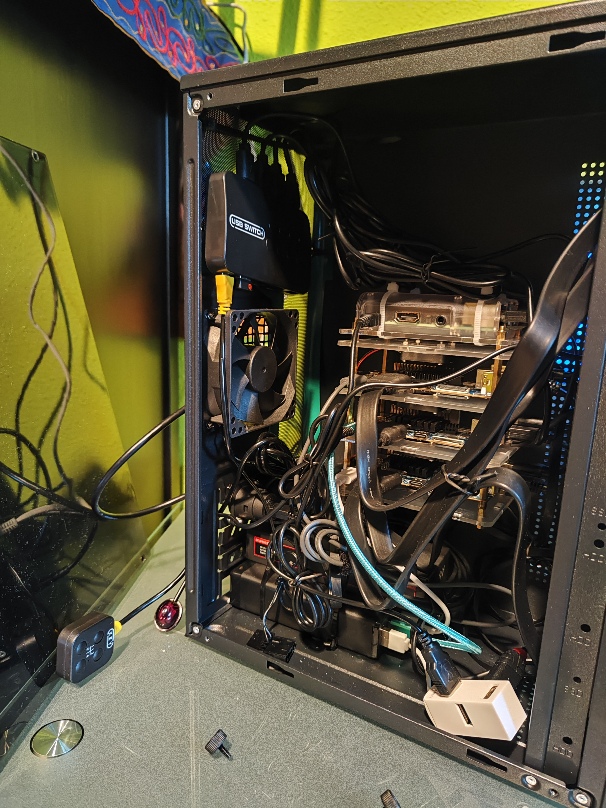

# Hardware

This document outlines the hardware montage for our Homelab. It is designed to serve various purposes, including server hosting, network management, or any kind of porject not related to this.

## Architecture


Our homelab is designed with the following server architecture:

1. Main Server (RapberriPi 3)
    - Will host the control plane of our Kuberenetes cluster because it requires less resources.
    - Acts as the bastion host for the homelab.
2. Secondary Servers (OrangePi 5)
    - Will host the worker nodes of Kubernetes.
    - Enhances the overall processing capacity of the homelab.
3. Ethernet Switch
    - Will connect all the devices with the Home network.
    - It is important to use a Gigabit Ethernet network for better performance.
4. Power Supply
    - A +160W Power Supply with USB ports will supply power to all our devices.
5. HDMI Splitter
    - All devices are connected to a HDMI switch so we can connect to any of them using a single HDMI cable.
5. USB Splitter
    - If neccesary, using a wireless keyboard we will able to connect to the devices.

### Networking

1. Local Network
    - Gigabit Ethernet Switch is connected to the Home network.
    - Gigabit Ethernet Switch connects all devices within the local network.
    - Each Raspberry Pi has a static IP address and a hostname.
2. Communication Flow
    - Devices communicate through the local switch.
    - Traffic is routed through Home Internet router for external communication.
    - External Traffic will be routed by the router to the cluster using NAT.

### Storage

1. SD Card
    - OS will be stored in MicroSDXC Class 10.
2. SSD
    - Important data is stored in the SSD disks of the Orangepi devices.
    - Additional, several Kubernetes storage services will be installed to add additional redundancy and backups.


## Hardware Components

This is the list of Hardware Components needed in order to setup our Homelab with enough cpu and memory capacity for our needs:

| Name                                                       | Link                                                                                                                 |
|------------------------------------------------------------|----------------------------------------------------------------------------------------------------------------------|
| 1x Raspberri Pi 3 or later (2 GB Ram or better)            | I reuse an old one.                                                                                                  |
| >3x OrangePi 5 with >=16 GB Ram.                           | In my case I will use OrangePi 5 model B which includes internal storage.                                            |
|                                                            | [:simple-aliexpress: Buy](https://www.aliexpress.com/item/1005005057630718.html)                                    |
| Case + Fan for all devices                                 | [:simple-aliexpress: Buy](https://www.aliexpress.com/item/1005005057630718.html)                                    |
| 4x 64 GB microSDXC card (Samsung EVO Plus MicroSDXC 64 GB) | [:simple-amazon: Buy](https://www.amazon.com/SAMSUNG-microSDXC-Expanded-MB-MC64KA-AM/dp/B09THJ25JR/)                |
| 3x NVME 256GB SSD (if using OrangePi model 5 or 5+)        | [:simple-amazon: Buy](https://www.amazon.com/Kingston-250G-2280-Internal-SNV2S/dp/B0BBWH7DBT/)                      |
| Gigabit Switch 8 Ports                                     | [:simple-aliexpress: Buy](https://www.aliexpress.com/item/1005005315707615.html)                                    |
| HDMI Splitter 5x1                                          | [:simple-aliexpress: Buy](https://www.aliexpress.com/item/1005005905850399.html)                                    |
| USB Splitter 3x3                                           | [:simple-aliexpress: Buy](https://www.aliexpress.com/item/1005005905850399.html)                                    |
| +200W power supply Splitter 5x1                            | [:simple-amazon: Buy](https://www.amazon.com/Aluminum-Charger-Charging-Station-Compatible/dp/B0BFN6JKMV/ref=sr_1_5) |
| Mini PC case                                               | [:simple-amazon: Buy](https://www.amazon.es/dp/B0CGV9Q3VP)                                                          |
| PC Chassis Cooling Dust Mesh                               | [:simple-aliexpress: Buy](https://www.aliexpress.com/item/1005005677590985.html)                                    |
| RJ45 female-female connector                               | [:simple-aliexpress: Buy](https://www.aliexpress.com/item/1005002947244816.html)                                    |
| HDMI female-female connector                               | [:simple-aliexpress: Buy](https://www.aliexpress.com/item/1005002946714841.html)                                    |
| HDMI, USB and Ethernet cables (sort 0.5m)                  |                                                                                                                      |
| Nuts, washers, screws, clamps, etc.                        |                                                                                                                      |


## Montage

### Step 1: Assembling the Cluster

The first crucial step in assembling your cluster is unboxing the devices and testing them individually. This ensures that each Raspberry Pi is functioning correctly before integrating them into your custom cabinet. Follow these sub-steps:

!!! warning

    - Unbox each ARM device carefully.
    - Test each device separately to ensure they are running without any problems.
    - Install an operating system (OS) onto a microSD card. (Refer to the [Setting Up the OS](#setting-up-the-os) section for detailed instructions on OS installation.)  

1. Placement in the Case:
      1. Install each Raspberry Pi into the bottom part of the case, 
      2. Ensure they are securely seated.
2. Connecting the Cases: 
      1. Using the longer screws provided, connect the cases together.
      2. Finally, close the device by placing the top case.
3. SD Card Installation:
      1. Insert the prepared microSD card with the operating system installed into each Raspberry Pi.
4. Power and Networking
      1. Plug each Raspberry Pi into a power supply.
      2. Connect them to an Ethernet router.
5. Verification:
      1. Check that each Raspberry Pi has green lights on the board and some flickering lights in the Ethernet ports. 
      2. It will indicate that they are receiving power and network connectivity.
6. Monitor Connection:
      1. Connect the cluster to a monitor using the HDMI port.
      2. You should see a command shell interface.

<figure markdown="span">
  { width="500" }
  <figcaption>Assembly example by Sheldonwl</figcaption>
</figure>


### Step 2: Adapting a PC Case as the Cluster Cabinet

Now, let's proceed with adapting a PC case to serve as the cabinet for our cluster. This step involves mounting the ARM cluster in the center of the case, adding a visually striking element to your setup.

1. Preparing the Case:
       1. Using screws or rivets, attach a mounting squad inside the case where the cluster will be situated.
       2. This squad will provide a stable base for securing the cluster.
2. Installing the Cluster:
       1. Unscrew the bottom part of the case of the cluster to prepare it for installation.
       2. Attach the bottom part of the cluster securely onto the mounting squad inside the case.
       3. Ensure that the cluster is positioned correctly and securely within the case.
3. Connecting Ports:
      1. Attach USB, Ethernet, and HDMI connectors to the back of the case using screws or suitable fasteners.
      2. This setup allows for easy access to the ports both internally and externally, facilitating connections to other components.
4. Ensuring Security and Alignment:
      1. Double-check that all components are securely installed within the case and properly aligned.
      2. This step ensures stability and prevents any movement or misalignment during operation.


<figure markdown="span">
  { width="500" }
  <figcaption>Squad installation</figcaption>
</figure>

<figure markdown="span">
  { width="500" }
  <figcaption>Installation details</figcaption>
</figure>

<figure markdown="span">
  { width="500" }
  <figcaption>Back of the case</figcaption>
</figure>

By adapting a PC case to house your cluster, you not only provide a sturdy and visually appealing enclosure but also create a centerpiece that attracts attention and sparks curiosity.

### Step 3: Assembling Components and Connecting to the Cluster

Now, let's move on to installing and connecting additional components to our cluster. This step involves integrating the power supply, Ethernet switch, HDMI splitter, and USB splitter. Please note that the placement of these components may vary depending on your personal preferences, the type of PC case used, and ventilation requirements. Here's how to proceed:

!!! warning

    This setup reflects a personal approach to organizing the components within the PC case. Depending on factors such as case design and ventilation requirements, you may need to adjust the placement of components accordingly. 

1. Installing Power Supply and Ethernet Switch:
      1. Position the main power supply and Ethernet switch at the bottom of the case.
      2. Secure them using clamps, ensuring they are as close as possible to the back of the case for easy access to power and networking connections.
2. Mounting Splitters:
      1. Install the HDMI splitter and USB splitter at the top of the case.
      2. Use clamps to securely hold them in place.
3. Connecting Power and Ports:
      1. Connect the power supply to each device.
      2. Connect the HDMI ports of the devices to the input of the HDMI splitter.
      3. Connect the USB ports of the devices to the output of the USB splitter.
      4. Connect the Ethernet ports of the devices to the Ethernet switch.
4. Connecting External Ports:
      1.  Connect the connectors installed at the back of the case to the HDMI splitter and Ethernet switch.
      2.  Ensure all connections are secure to prevent any interruptions or loose connections.
5.  Final Touches:
      1.  Connect a USB mouse receiver to the input of the USB splitter for user interaction.
      2. Gather and organize the cables using ropes or rubber bands to maintain a neat and tidy appearance.
      3. This helps to minimize clutter and prevents tangling of cables, ensuring easy maintenance and accessibility.

<figure markdown="span">
  { width="500" }
  <figcaption>Cluster connected</figcaption>
</figure>

<figure markdown="span">
  { width="500" }
  <figcaption>Final assembly</figcaption>
</figure>

By assembling the components and connecting them to the cluster in this manner, you ensure an organized and efficient setup that facilitates communication, power distribution, and user interaction with your cluster.

## Setting Up the OS

In this final part, we'll dive into setting up the operating system for our devices. When it comes to ARM devices like the Raspberry Pi, there are various options available:

- **Stock OS**: These are operating systems maintained by the vendor of the device, which could include Windows, Linux, or even Android.
- **Custom OS**: These are maintained by the community and may cater to specific use cases, such as TV players, RetroMachines, or Steam machines.

For our project, we've chosen to use a Linux distribution based on Debian called  [DietPi](https://dietpi.com/), which is well-suited for ARM devices like the Raspberry Pi and OrangePi. Furthermore, DietPi offers an option for an automatic first boot installation, which is crucial for our project's goal of automation.


### DietPi Setup

Here's how to proceed:

1. Download and Extract DietPi Image:
      1. Download the DietPi disk image from the official website and extract it to your computer.
2. Flash the DietPi Image:
      1. Use a third-party program such as [balenaEtcher](https://etcher.balena.io/) to flash the DietPi image onto the microSD cards.
3. Prepare for First Boot:
      1. Modify the configuration file located at ```{SD_CARD}/dietpi.txt``` to set up initial configurations as needed. See [dietpi.txt configuration](#dietpitxt-configuration).
      2. Modify the configuration file located at ```{SD_CARD}/dietpiEnv.txt``` to set up initial boot configurations as needed. See [dietpiEnv.txt configuration](#dietpienvtxt-configuration).
4. Initial Boot:
      1. Insert the prepared microSD cards into the devices.
      2. Power on the devices and wait for the boot process to complete.
5. SSH Connection:
      1. Once booted, attempt to connect to each device using SSH and the IP address configured beforehand.

### dietpi.txt configuration

When modifying the ```dietpi.txt``` configuration file, pay close attention to the following properties:

```
AUTO_SETUP_TIMEZONE=Etc/UTC

AUTO_SETUP_NET_USESTATIC=1
AUTO_SETUP_NET_STATIC_IP=192.168.31.100
AUTO_SETUP_NET_STATIC_MASK=255.255.255.0
AUTO_SETUP_NET_STATIC_GATEWAY=192.168.31.1
AUTO_SETUP_NET_STATIC_DNS=1.1.1.1 1.0.0.1

AUTO_SETUP_DHCP_TO_STATIC=1
AUTO_SETUP_NET_HOSTNAME=my-device-1


AUTO_SETUP_SSH_PUBKEY=YOUR_SSH_PUBLIC_KEY
SOFTWARE_DISABLE_SSH_PASSWORD_LOGINS=1

AUTO_SETUP_AUTOMATED=1
AUTO_SETUP_GLOBAL_PASSWORD=SOME_STRONG_PASSWORD

SOFTWARE_DIETPI_DASHBOARD_BACKEND=1
```

!!! info

    For more info, go to [How to do an automatic base installation at first boot](https://dietpi.com/docs/usage/#how-to-do-an-automatic-base-installation-at-first-boot-dietpi-automation)


### dietpiEnv.txt configuration

In case of DietPi, **Orange PI 5B** is not specifically supported, so it is neccesary to execute several commands to support of the hardware. Add the following line:

```bash
fdtfile=rockchip/rk3588s-orangepi-5b.dtb
```