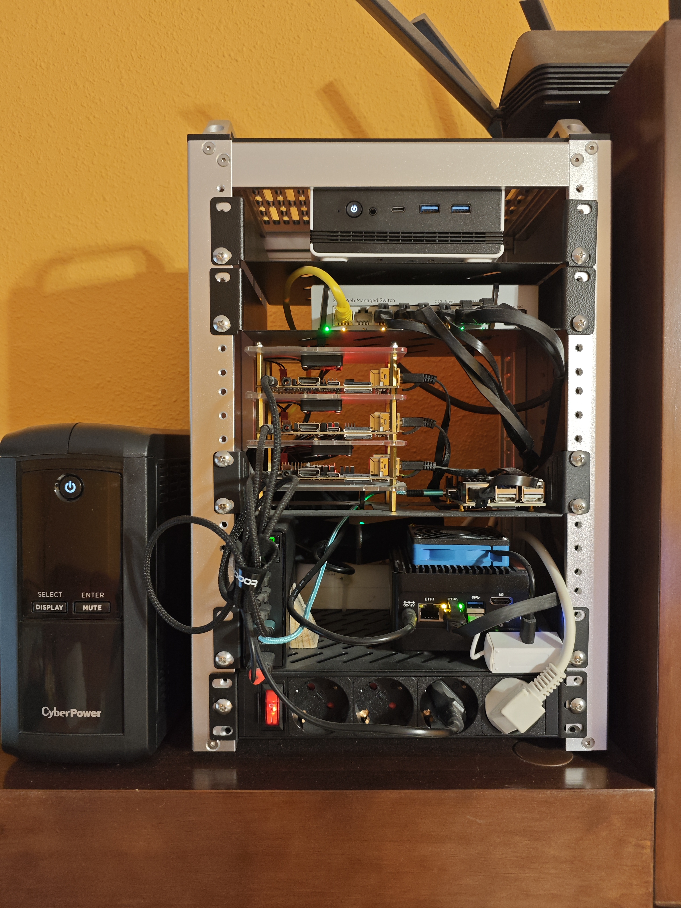
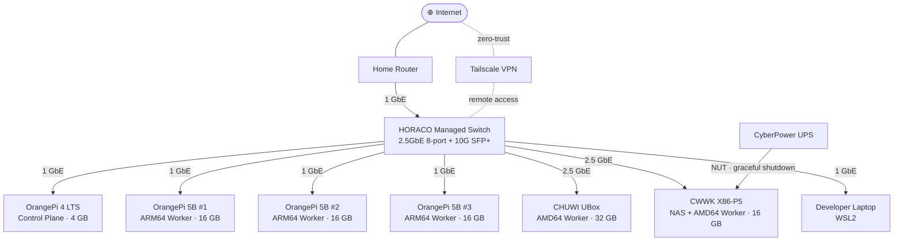

# Hardware

This document outlines the hardware setup for our Homelab — a cluster designed for data platform hosting, AI workloads, home automation, and general experimentation.

## Server Rack

All cluster hardware (except the UPS and developer laptop) is mounted in a **DeskPi RackMate T1-Plus** — a compact, open-frame desktop rack designed for mini-PCs and SBCs.

<figure markdown="span">
  { width="700" }
  <figcaption>The current homelab cluster — May 2026</figcaption>
</figure>

### DeskPi RackMate T1-Plus

| | |
|-|-|
| **Form factor** | Desktop open-frame rack |
| **Rack units** | 6U |
| **Compatibility** | Mini-ITX, SBC clusters, 1U accessories |
| **Source** | [DeskPi RackMate T1-Plus](https://deskpi.com/products/deskpi-rackmate-t1-plus) |

The T1-Plus sits on a shelf and holds the full cluster in a compact footprint. Its open-frame design provides good passive airflow across the SBCs and mini-PCs. Layout from top to bottom:

| Slot | Device |
|------|--------|
| Top | CHUWI UBox (AMD64 worker) |
| 2nd | HORACO 2.5GbE Managed Switch |
| 3rd | OrangePi stack (4 boards on acrylic standoffs — control plane + 3 ARM64 workers) |
| 4th | CWWK X86-P5 (NAS + AMD64 worker) |
| Bottom | PDU / power strip |

The CyberPower UPS sits beside the rack on the same shelf.

## Architecture

```mermaid
graph TD
    Internet(["🌐 Internet"])
    Router["Home Router"]
    Tailscale["Tailscale VPN"]

    Internet --- Router
    Internet -. "zero-trust" .- Tailscale

    Router -->|"1 GbE"| Switch["HORACO Managed Switch\n2.5GbE 8-port + 10G SFP+"]

    Switch -->|"1 GbE"| CP["OrangePi 4 LTS\nControl Plane · 4 GB"]
    Switch -->|"1 GbE"| W1["OrangePi 5B #1\nARM64 Worker · 16 GB"]
    Switch -->|"1 GbE"| W2["OrangePi 5B #2\nARM64 Worker · 16 GB"]
    Switch -->|"1 GbE"| W3["OrangePi 5B #3\nARM64 Worker · 16 GB"]
    Switch -->|"2.5 GbE"| AMD["CHUWI UBox\nAMD64 Worker · 32 GB"]
    Switch -->|"2.5 GbE"| NAS["CWWK X86-P5\nNAS + AMD64 Worker · 16 GB"]
    Switch -->|"1 GbE"| Laptop["Developer Laptop\nWSL2"]

    UPS["CyberPower UPS"] -->|"NUT · graceful shutdown"| NAS
    Tailscale -. "remote access" .- Switch
```

The cluster has evolved over time as hardware was added and replaced. The current generation combines a lightweight ARM control plane with x86 mini-PCs as the primary compute workhorses.

1. **Control Plane — OrangePi 4 LTS (4 GB RAM)**
    - Hosts the K3s control plane; low resource requirements make it a good fit.
    - Connected to the home network switch as the cluster entry point.
2. **ARM64 Workers — OrangePi 5B × 3 (16 GB RAM each)**
    - RK3588 SoC — 8-core ARM Cortex-A76/A55, integrated NVMe storage.
    - Original worker nodes; suitable for lightweight and multi-arch workloads.
3. **AMD64 Worker — CHUWI UBox (AMD 6600H, 32 GB RAM)**
    - High-performance mini-PC; used for compute-heavy jobs (Spark, Trino, LLM inference).
4. **NAS + Worker — CWWK X86-P5 (Intel N305, 16 GB RAM, RAID 3×1TB HDD + 128 GB NVMe)**
    - Acts as the NFS file server and a Kubernetes worker simultaneously.
    - RAID array provides bulk storage for media and backups.
5. **CyberPower UPS**
    - Protects the cluster against power outages and ensures a clean, graceful shutdown.
    - Integrated with TrueNAS via the NUT protocol — when power is lost TrueNAS triggers a coordinated cluster-wide shutdown.
    - Power metrics are exported via a Prometheus exporter and visualised in Grafana.
6. **HORACO 2.5GbE Managed Switch (8-port 2.5GBASE-T + 10G SFP+)**
    - The NAS (CWWK X86-P5) and the AMD64 worker (CHUWI UBox) both have 2.5GbE NICs and connect at full speed.
    - OrangePi nodes connect at 1 GbE; port isolation ensures the NAS sustains 2.5 GbE throughput to multiple 1G clients simultaneously without bottlenecking.
    - VLAN support segments cluster traffic away from the home router network.
7. **Developer Laptop (WSL2)**
    - Connected to the cluster over the local network; used as a dev/overflow worker node.

### Networking

1. **Local Network**
    - All cluster nodes connect via the HORACO managed switch with static IP addresses configured at the OS level.
    - The NAS and AMD64 worker run at 2.5 GbE; OrangePi nodes run at 1 GbE.
    - VLANs isolate cluster-internal traffic from the home router network, preventing unnecessary broadcast traffic from reaching the rest of the LAN.
2. **Communication Flow**
    - Intra-cluster traffic stays on the local switch.
    - External access is handled by Tailscale VPN — no port forwarding required.
    - Traefik routes HTTP/HTTPS traffic to the correct services via IngressRoutes.

### Storage

1. **SD Card / eMMC**
    - OS is stored on microSDXC Class 10 (OrangePi) or eMMC (mini-PCs).
2. **NVMe SSD**
    - Each OrangePi 5B has an internal NVMe SSD for data and Longhorn storage.
    - The CWWK NAS has an additional 128 GB NVMe for fast metadata storage.
3. **RAID Array**
    - The CWWK NAS provides 3×1 TB RAID storage, shared via NFS for media and large files.
4. **Kubernetes Storage Services**
    - Longhorn provides distributed block storage across worker nodes.
    - Garage provides S3-compatible object storage for the data lake and backups.

## Hardware Components

The current hardware used in the cluster. The list has evolved since the initial setup — see [Lessons Learned](../lessons-learned.md) for context on hardware choices.

**Servers**

| Device | Specs | Role |
|--------|-------|------|
| OrangePi 4 LTS | 4 GB RAM, RK3399, microSD | Control Plane |
| OrangePi 5B × 3 | 16 GB RAM, RK3588, internal NVMe | ARM64 Workers |
| CHUWI UBox | AMD 6600H, 32 GB RAM | AMD64 Worker |
| CWWK X86-P5 | Intel N305, 16 GB RAM, 3×1 TB RAID HDD + 128 GB NVMe | NAS + AMD64 Worker |

**Networking & Power**

| Device | Notes |
|--------|-------|
| HORACO 2.5GbE Managed Switch 8-port + 10G SFP+ | 2.5 GbE to NAS and AMD64 worker; 1 GbE to OrangePi nodes; VLAN support |
| CyberPower UPS | Protects against power outages; NUT integration with TrueNAS for graceful shutdown; monitored via Prometheus + Grafana |
