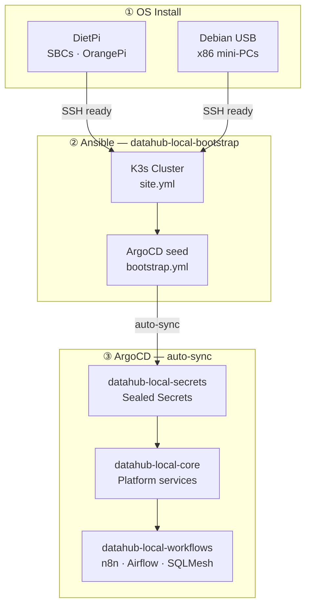
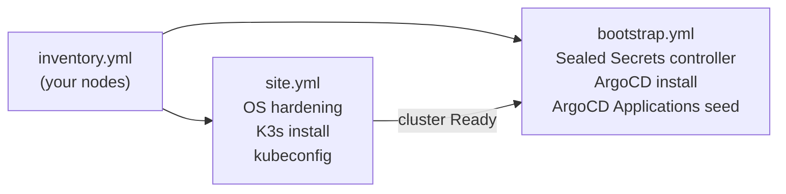
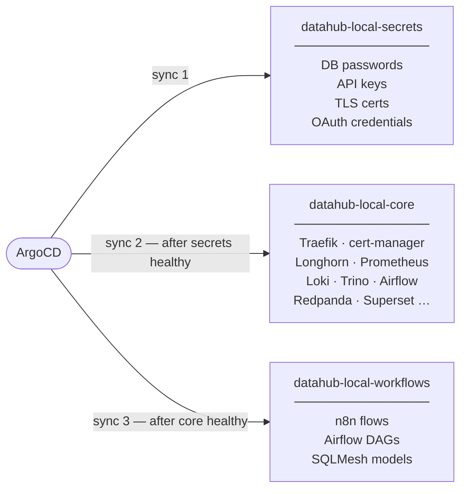

# Provisioning

From bare hardware to a fully running platform in three phases. Each phase hands off to the next — once the OS is reachable over SSH, a single Ansible run installs K3s and seeds ArgoCD, which then reconciles the entire platform automatically.



---

## Phase 1 — OS Installation

Install a base Linux OS on each node. Two supported paths:

=== "DietPi (SBCs)"

    Recommended for OrangePi and other SBC nodes — minimal footprint, pre-configured SSH, hardware optimisations out of the box.

    1. Download the DietPi image for your board from [dietpi.com](https://dietpi.com/#download)
    2. Flash to SD card or eMMC with [Balena Etcher](https://etcher.balena.io/) or `dd`
    3. Before first boot, edit `dietpi.txt` on the boot partition:

        ```ini
        AUTO_SETUP_LOCALE=en_GB.UTF-8
        AUTO_SETUP_TIMEZONE=Europe/London
        AUTO_SETUP_NET_ETHERNET_ENABLED=1
        AUTO_SETUP_SSH_SERVER_INDEX=-2        # OpenSSH
        AUTO_SETUP_AUTOMATED=1
        ```

    4. Boot the node — DietPi completes first-run setup automatically and enables SSH.

=== "Debian (x86 mini-PCs)"

    Recommended for the CHUWI UBox and CWWK NAS — standard Debian netinstall via USB.

    1. Download [Debian netinstall ISO](https://www.debian.org/distrib/netinst)
    2. Flash to USB with Etcher or `dd`
    3. Boot from USB and follow the installer — minimal install, no desktop
    4. Enable SSH: `systemctl enable --now ssh`

**After OS install on all nodes:**

- Assign static IPs at the OS level (edit `/etc/network/interfaces` or `dietpi-config`)
- Confirm SSH access from your dev machine:
    ```bash
    ssh root@<node-ip>
    ```

---

## Phase 2 — Ansible

The [datahub-local-bootstrap](https://github.com/datahub-local/datahub-local-bootstrap) repository provisions the cluster in two sequential playbooks:



### Setup

1. Clone the repository on your dev machine:

    ```bash
    git clone https://github.com/datahub-local/datahub-local-bootstrap
    cd datahub-local-bootstrap
    ```

2. Create your inventory file from the sample:

    ```bash
    cp inventory-sample.yml inventory.yml
    ```

3. Edit `inventory.yml` — define your nodes, roles, and connection details.

### Run

1. Ensure Python prerequisites are available on all nodes:

    ```bash
    ansible k3s_cluster -i inventory.yml -b -m shell \
      -a "apt-get update && apt-get install -y python3 python3-pip python3-apt"
    ```

2. Provision the OS and install K3s:

    ```bash
    ansible-playbook playbook/site.yml -i inventory.yml
    ```

3. Install ArgoCD and seed the initial Applications:

    ```bash
    ansible-playbook playbook/bootstrap.yml -i inventory.yml
    ```

After this phase completes, `kubectl get nodes` shows all nodes `Ready` and ArgoCD is running and watching its application repositories.

---

## Phase 3 — ArgoCD GitOps

From this point ArgoCD takes over entirely. It reconciles three repositories in dependency order — no manual `helm install` or `kubectl apply` needed.



| Stage | Repository | What it deploys |
|---|---|---|
| **1 — Secrets** | [datahub-local-secrets](https://github.com/datahub-local/datahub-local-secrets) | Sealed Secrets — credentials needed by all platform services |
| **2 — Core** | [datahub-local-core](https://github.com/datahub-local/datahub-local-core) | All platform services via Helmfile ApplicationSets |
| **3 — Workflows** | [datahub-local-workflows](https://github.com/datahub-local/datahub-local-workflows) | n8n flows, Airflow DAGs, SQLMesh models |

### Monitoring the rollout

```bash
# watch all ArgoCD applications
kubectl -n argocd get applications -w

# or via the ArgoCD UI (available after core sync)
https://argocd.<your-domain>
```

---

## Useful Commands

```bash
# Reboot the entire cluster
ansible-playbook playbook/reboot.yml -i inventory.yml

# Graceful cluster shutdown
ansible-playbook playbook/shutdown.yml -i inventory.yml
```
