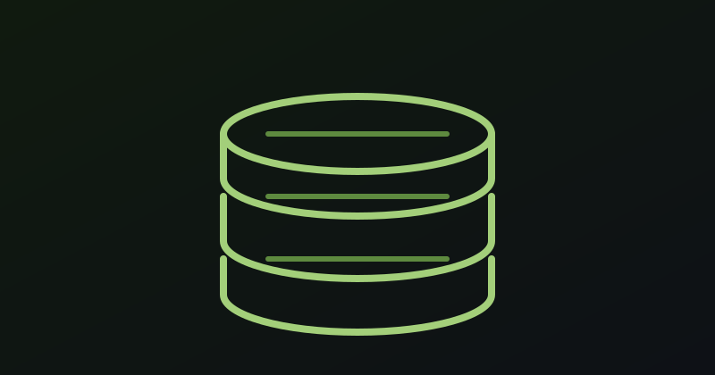
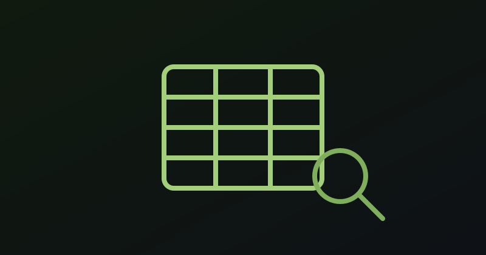

---
hide:
  - navigation
  - toc
  - title
---

  
  <h1 class="hero-claim">Enterprise Data &amp; AI at Home</h1>
  
A private cloud solution based on k8s running a production-grade lakehouse, autonomous agents, and full observability. It is assembled from open source and operated from Git in a home rack.

  

    <a href="projects/index.md" class="md-button md-button--primary">Explore the 15 projects</a>
    <a href="#practices" class="md-button">See how it runs</a>
    <a href="https://github.com/datahub-local" class="author-link author-link--github" target="_blank" rel="noopener noreferrer">
      <svg viewBox="0 0 24 24" xmlns="http://www.w3.org/2000/svg" aria-hidden="true"><path d="M12 .297c-6.63 0-12 5.373-12 12 0 5.303 3.438 9.8 8.205 11.385.6.113.82-.258.82-.577 0-.285-.01-1.04-.015-2.04-3.338.724-4.042-1.61-4.042-1.61C4.422 18.07 3.633 17.7 3.633 17.7c-1.087-.744.084-.729.084-.729 1.205.084 1.838 1.236 1.838 1.236 1.07 1.835 2.809 1.305 3.495.998.108-.776.417-1.305.76-1.605-2.665-.3-5.466-1.332-5.466-5.93 0-1.31.465-2.38 1.235-3.22-.135-.303-.54-1.523.105-3.176 0 0 1.005-.322 3.3 1.23.96-.267 1.98-.399 3-.405 1.02.006 2.04.138 3 .405 2.28-1.552 3.285-1.23 3.285-1.23.645 1.653.24 2.873.12 3.176.765.84 1.23 1.91 1.23 3.22 0 4.61-2.805 5.625-5.475 5.92.42.36.81 1.096.81 2.22 0 1.606-.015 2.896-.015 3.286 0 .315.21.69.825.57C20.565 22.092 24 17.592 24 12.297c0-6.627-5.373-12-12-12"/></svg>
      GitHub
    </a>
  

  

    
Running on battle-tested open source

    

      Kubernetes
      K3s
      ArgoCD
      Helm
      Ansible
      Trino
      Iceberg
      Apache Spark
      Apache Airflow
      Redpanda
      dbt
      dlt
      Prometheus
      Grafana
      Loki
      Ollama
      Tailscale
      CloudNative PG
      Garage
      Longhorn
    

  

  

    <h2>Featured work</h2>
    
Six of fifteen projects, each with a full case study behind it.

  

  

    <article class="work-card">
      
      

        
Platform

        <h3 class="work-card__title"><a href="projects/cloud-at-home.md">Cloud-at-home on mini-PCs</a></h3>
        
Seven mixed ARM64/AMD64 nodes assembled, provisioned, and operated entirely from Git.

        <a class="work-card__link" href="projects/cloud-at-home.md">Read the case study →</a>
      

    </article>
    <article class="work-card">
      
      

        
Data &amp; Analytics

        <h3 class="work-card__title"><a href="projects/lakehouse-core.md">Lakehouse core stack</a></h3>
        
Iceberg on Garage, a Polaris catalog, Trino federation, dbt models, and Superset dashboards.

        <a class="work-card__link" href="projects/lakehouse-core.md">Read the case study →</a>
      

    </article>
    <article class="work-card">
      
      

        
Data &amp; Analytics

        <h3 class="work-card__title"><a href="projects/semantic-layer.md">Semantic layer for agents</a></h3>
        
One catalogued, versioned SQL surface that both dashboards and AI agents query.

        <a class="work-card__link" href="projects/semantic-layer.md">Read the case study →</a>
      

    </article>
    <article class="work-card">
      
      

        
AI &amp; Agents

        <h3 class="work-card__title"><a href="projects/mcp-platform.md">MCP platform</a></h3>
        
Read-only MCP servers that give local agents verifiable facts without unrestricted access.

        <a class="work-card__link" href="projects/mcp-platform.md">Read the case study →</a>
      

    </article>
    <article class="work-card">
      
      

        
AI &amp; Agents

        <h3 class="work-card__title"><a href="projects/sre-agents.md">SRE agents (Sympozium)</a></h3>
        
Narrow, scheduled agents that investigate alerts and report with evidence, not guesswork.

        <a class="work-card__link" href="projects/sre-agents.md">Read the case study →</a>
      

    </article>
    <article class="work-card">
      
      

        
Application

        <h3 class="work-card__title"><a href="projects/bodega.md">Bodega shopping analytics</a></h3>
        
Supermarket invoices become a structured dataset and a weekly spend digest, with no rows published.

        <a class="work-card__link" href="projects/bodega.md">Read the case study →</a>
      

    </article>
  

  

    <h2 id="practices">Enterprise practices, not a lab</h2>
    
Every discipline an enterprise expects, running on hardware you can touch.

  

  

    <section class="cap-card">
      <h3>Infrastructure as code</h3>
      
Ansible provisions the OS and K3s; Helmfile ApplicationSets describe the services. Nothing is set up by hand. <a href="cluster_setup/provisioning.md">Provisioning</a>

    </section>
    <section class="cap-card">
      <h3>GitOps delivery</h3>
      
ArgoCD continuously reconciles one Application per namespace, with server-side apply and auto-sync on every commit. <a href="services/automation.md">Automation</a>

    </section>
    <section class="cap-card">
      <h3>CI/CD &amp; governance</h3>
      
GitHub Actions gates every change and Renovate keeps dependencies current; all work lands through reviewed pull requests. Cost management favours local inference and free-tier models over per-token spend. <a href="services/cicd.md">CI/CD</a>

    </section>
    <section class="cap-card">
      <h3>Identity, secrets &amp; access</h3>
      
Dex turns GitHub OAuth into OIDC for SSO, OAuth2-Proxy protects services, Tailscale gives zero-trust access, and secrets management uses Sealed Secrets mirrored by Reflector. <a href="services/security.md">Security</a>

    </section>
    <section class="cap-card">
      <h3>Observability &amp; reliability</h3>
      
Prometheus, Loki, Grafana, AlertManager, and Robusta watch the estate; reliability and backups come from Longhorn replication, Velero, and Kopia. <a href="services/monitoring.md">Monitoring</a>

    </section>
    <section class="cap-card">
      <h3>Data &amp; AI platform</h3>
      
The data platform runs Garage, Iceberg, Polaris, and Trino, with streaming on Redpanda and orchestration through Airflow, dbt, and dlt; the AI platform runs local Ollama inference and Sympozium agents. <a href="services/data.md">Data Stack</a> · <a href="services/ai.md">AI</a>

    </section>
  

  

    <h2 id="proof">Proof, not promises</h2>
    
Every figure is traceable to the live cluster, a public repository, or this site. Nothing here is invented.

  

  

    

7

Cluster nodes
<small><a href="architecture/overview.md">Architecture</a></small>

    

25+

Services deployed
<small><a href="services/core.md">Services</a></small>

    

52 cores 140 GB

Compute
<small><a href="cluster_setup/hardware.md">Hardware</a></small>

    

3

Storage tiers
<small><a href="architecture/overview.md">Architecture</a></small>

    

20

Monitoring targets
<small><a href="services/monitoring.md">Monitoring</a></small>

    

15

Repositories
<small><a href="https://github.com/datahub-local">GitHub</a></small>

  

  

    
“MinIO changed its license and removed the open-source images with very short notice. By the time the removal date was close, it became a forced, rushed migration.”

    <cite>From <a href="lessons-learned.md">Lessons Learned</a>: what failed, why, and what it produced</cite>
  

  

    <h2>What's next</h2>
    <ul>
      <li><strong>Broader MCP tool coverage.</strong> Wider fact-gathering with every mutating operation behind explicit policy and approval.</li>
      <li><strong>More use cases.</strong> New data sources, streaming pipelines, and agents, each added as a card and a case study.</li>
      <li><strong>Impact metrics.</strong> Longer-running outcome measures with a defined source.</li>
    </ul>
  

  <h2>Authors</h2>

  

    
    

      <h3 class="author-name">Alvaro Santos Andres</h3>
      

        Data &amp; AI engineer building production-grade platforms on open-source tech.
        DataHub.local is a real, running homelab. It spans Kubernetes on ARM64, LLM pipelines, and GitOps, all built and improved in the open.
      

      

        <a href="{{ personal_site_url }}" class="author-link author-link--personal" target="_blank" rel="noopener noreferrer">
          <svg viewBox="0 0 24 24" xmlns="http://www.w3.org/2000/svg" aria-hidden="true"><path d="M12 2a10 10 0 1 0 0 20 10 10 0 0 0 0-20zm7.93 9h-3.02a15.7 15.7 0 0 0-1.2-5.4A8.03 8.03 0 0 1 19.93 11zM12 4.04c.83 1.2 1.55 3.1 1.83 6.96h-3.66C10.45 7.14 11.17 5.24 12 4.04zM4.07 11a8.03 8.03 0 0 1 4.22-5.4A15.7 15.7 0 0 0 7.09 11H4.07zm0 2h3.02c.22 2.2.63 4.06 1.2 5.4A8.03 8.03 0 0 1 4.07 13zM12 19.96c-.83-1.2-1.55-3.1-1.83-6.96h3.66c-.28 3.86-1 5.76-1.83 6.96zM16.71 13h3.22a8.03 8.03 0 0 1-4.22 5.4c.57-1.34.98-3.2 1.2-5.4z"/></svg>
          Personal site
        </a>
        <a href="https://www.linkedin.com/in/alvsanand/" class="author-link author-link--linkedin" target="_blank" rel="noopener noreferrer">
          <svg viewBox="0 0 24 24" xmlns="http://www.w3.org/2000/svg" aria-hidden="true"><path d="M20.447 20.452h-3.554v-5.569c0-1.328-.027-3.037-1.852-3.037-1.853 0-2.136 1.445-2.136 2.939v5.667H9.351V9h3.414v1.561h.046c.477-.9 1.637-1.85 3.37-1.85 3.601 0 4.267 2.37 4.267 5.455v6.286zM5.337 7.433c-1.144 0-2.063-.926-2.063-2.065 0-1.138.92-2.063 2.063-2.063 1.14 0 2.064.925 2.064 2.063 0 1.139-.925 2.065-2.064 2.065zm1.782 13.019H3.555V9h3.564v11.452zM22.225 0H1.771C.792 0 0 .774 0 1.729v20.542C0 23.227.792 24 1.771 24h20.451C23.2 24 24 23.227 24 22.271V1.729C24 .774 23.2 0 22.222 0h.003z"/></svg>
          LinkedIn
        </a>
        <a href="https://github.com/alvsanand" class="author-link author-link--github" target="_blank" rel="noopener noreferrer">
          <svg viewBox="0 0 24 24" xmlns="http://www.w3.org/2000/svg" aria-hidden="true"><path d="M12 .297c-6.63 0-12 5.373-12 12 0 5.303 3.438 9.8 8.205 11.385.6.113.82-.258.82-.577 0-.285-.01-1.04-.015-2.04-3.338.724-4.042-1.61-4.042-1.61C4.422 18.07 3.633 17.7 3.633 17.7c-1.087-.744.084-.729.084-.729 1.205.084 1.838 1.236 1.838 1.236 1.07 1.835 2.809 1.305 3.495.998.108-.776.417-1.305.76-1.605-2.665-.3-5.466-1.332-5.466-5.93 0-1.31.465-2.38 1.235-3.22-.135-.303-.54-1.523.105-3.176 0 0 1.005-.322 3.3 1.23.96-.267 1.98-.399 3-.405 1.02.006 2.04.138 3 .405 2.28-1.552 3.285-1.23 3.285-1.23.645 1.653.24 2.873.12 3.176.765.84 1.23 1.91 1.23 3.22 0 4.61-2.805 5.625-5.475 5.92.42.36.81 1.096.81 2.22 0 1.606-.015 2.896-.015 3.286 0 .315.21.69.825.57C20.565 22.092 24 17.592 24 12.297c0-6.627-5.373-12-12-12"/></svg>
          GitHub
        </a>
      

    

  

