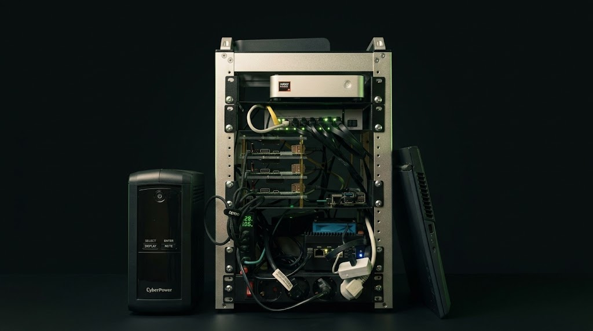

# Cloud-at-home on mini-PCs

A seven-node heterogeneous Kubernetes cluster assembled, provisioned, and
operated from Git. It is the foundation every other project runs on.

  Platform &amp; Operations
  Running
  <a class="meta-pill meta-pill--github" href="https://github.com/datahub-local/datahub-local-bootstrap">:fontawesome-brands-github: datahub-local-bootstrap</a>
  <a class="meta-pill meta-pill--github" href="https://github.com/datahub-local/datahub-local-core">:fontawesome-brands-github: datahub-local-core</a>

<figure markdown="span">
  { width="1024" }
  <figcaption>The seven-node cluster, from the UPS and network switch to the ARM boards and the GPU node</figcaption>
</figure>

## Problem

Running production-like workloads at home means starting without the safety nets
a cloud provides: no managed control plane, no elastic capacity, and no vendor
who owns the failure. The first attempt was a cluster of consumer ARM
single-board computers. It worked for lightweight services but proved unreliable
and slow for data workloads, with SD-card failures and firmware quirks that
consumed more time than they saved.

The challenge was to turn a mixed pile of affordable hardware into something
that behaves like a real platform.

## Approach

The cluster is treated as a product with a delivery pipeline, not a collection
of machines.

- **Heterogeneous by design**: ARM64 boards carry lightweight and multi-arch
  workloads, while x86 mini-PCs, including a dedicated NAS and a GPU worker,
  handle Spark, Trino, and inference.
- **Provisioned as code**: Ansible installs the OS and K3s and seeds ArgoCD.
  After that first run, Git is the only interface to the cluster.
- **Delivered via GitOps**: ArgoCD reconciles one Application per namespace,
  layered as secrets, then core, then AI.
- **Storage matched to data**: replicated block storage for databases, object
  storage for the lakehouse, and bulk RAID for media and archives.
- **Hardware chosen on evidence**: the move to x86 mini-PCs was driven by
  measured performance-per-euro, not preference, and is documented in Lessons
  Learned.

## Technologies

- **K3s** on mixed ARM64 and AMD64 nodes
- **Ansible** for OS provisioning, K3s install, and ArgoCD bootstrap
- **ArgoCD** and Helmfile ApplicationSets for GitOps delivery
- **Longhorn**, **Garage**, and NFS for storage
- **Tailscale**, **Traefik**, and **cert-manager** for access and TLS

## Outcome

The result is a seven-node cluster that can be rebuilt from repositories and
whose state is continuously monitored. It has survived hardware replacement,
chart deprecations, and a storage migration, which is exactly the kind of
operational experience a homelab is for. Everything else in this catalogue runs
on it.

## Further reading

- [Architecture](../architecture/overview.md): the logical and physical layout
- [Hardware](../cluster_setup/hardware.md): the rack and its components
- [Provisioning](../cluster_setup/provisioning.md): from bare metal to running platform
- [Hard Lessons](../lessons-learned.md): the failures that shaped the design
