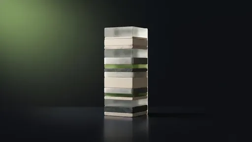
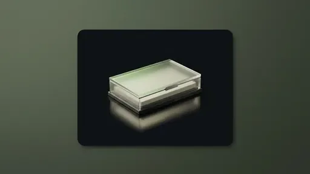
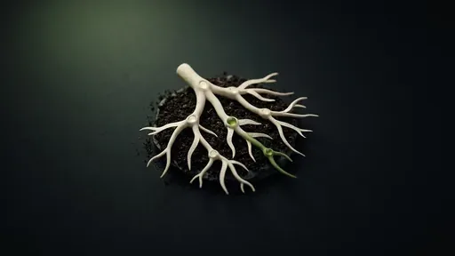
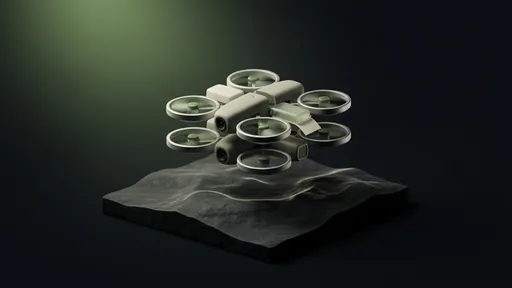
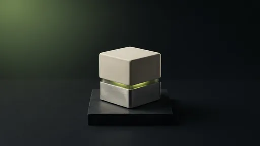
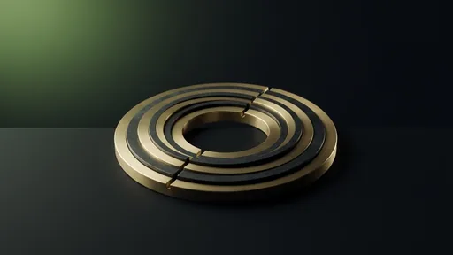
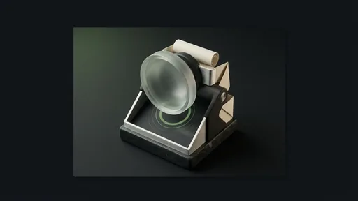
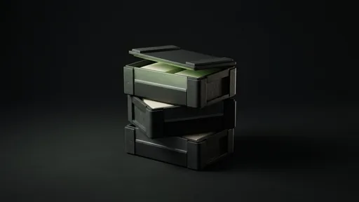

# Projects

The platform is not the point. What it produces is. This catalogue lists the
fourteen use cases built on DataHub.local across four areas. Every card opens a
full case study with the problem, approach, technologies, outcome, and source.

---

## Data & Analytics

- 

    :material-database: **[Lakehouse core stack](lakehouse-core.md)**

    Ingestion, Iceberg storage in Garage, a Polaris catalog, Trino federation,
    dbt transformations, and Superset dashboards.

- 

    :material-cart: **[Bodega shopping analytics](bodega.md)**

    Supermarket invoices turned into a structured Iceberg dataset and a weekly
    spend digest, described by method and aggregates only.

- 

    :material-cash-multiple: **[Personal finance datalake](personal-finance.md)**

    A private analytics pipeline over personal documents with a governed SQL
    surface and no source rows published.

- 

    :material-table: **[Semantic layer for agents](semantic-layer.md)**

    A catalogued, versioned SQL surface over the lakehouse so agents and BI
    tools query the same governed definitions.

- 

    :material-check-decagram: **[Data quality & lineage](data-quality-lineage.md)**

    dbt tests, explicit model lineage, and Iceberg snapshots applied to the
    lakehouse tables.

## AI & Agents

- 

    :material-robot-excited: **[SRE agents (Sympozium)](sre-agents.md)**

    Narrow, scheduled agents that investigate alerts and trends through bounded
    MCP tools and report in a fixed format.

- 

    :material-connection: **[MCP platform](mcp-platform.md)**

    Read-only Model Context Protocol servers exposing Prometheus, Loki,
    Kubernetes, Trino, Polaris, and Garage facts to agents safely.

- 

    :material-help-circle: **[Ask-your-cluster oracle](oracle-responder.md)**

    A natural-language front door over cluster and repository state for
    operational questions.

- 

    :material-newspaper-variant: **[n8n AI content engine](ai-content-engine.md)**

    Versioned, LLM-powered workflows for content drafting, diagram generation,
    and notification pipelines.

- 

    :material-gpu: **[Local inference + GPU node](local-inference.md)**

    A GPU worker serving a local model through Ollama for private, offline
    inference and agent workloads.

## Platform & Operations

- 

    :material-server-network: **[Cloud-at-home on mini-PCs](cloud-at-home.md)**

    A seven-node heterogeneous Kubernetes cluster assembled, provisioned, and
    operated from Git.

- 

    :material-source-branch: **[GitOps & platform engineering](gitops-platform.md)**

    ArgoCD reconciliation, layered repositories, quality gates, and automated
    dependency updates.

- 

    :material-chart-line: **[Observability stack](observability.md)**

    Metrics, logs, dashboards, and enriched alerting, plus a proactive AI
    monitoring loop above the rule-based one.

## Community

- 

    :material-package-variant: **[Giving Back to the Community](oss-charts.md)**

    Five published charts and exporters: Spark apps, Garage, Servarr,
    node-exporter textfiles, and Ollama metrics.

