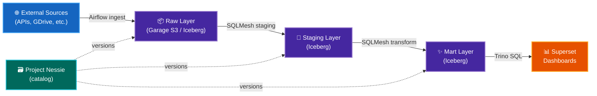
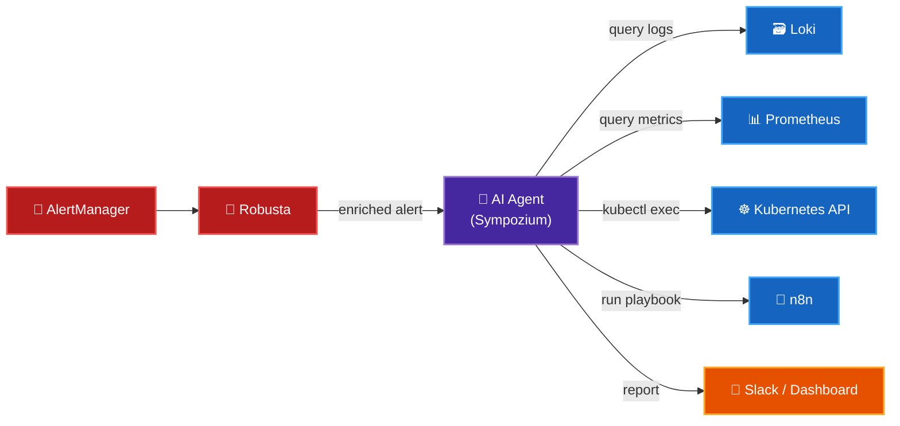

# Roadmap

What's coming next for DataHub.local — priorities are ordered by status: done, in progress, near-term, and medium-term.

---

## ✅ Completed

| Item | Details |
|------|---------|
| Homelab hardware & physical setup | Mixed ARM64/AMD64 cluster in a MicroATX case; CyberPower UPS; HORACO 2.5GbE managed switch |
| K3s Kubernetes cluster | 7-node cluster with GitOps, Longhorn, Traefik, cert-manager, Tailscale |
| Core services (GitOps) | ArgoCD ApplicationSet pipeline; encrypted secrets; Velero + Kopia backups; SSO via Dex |
| Data Lakehouse Infra | Trino + Project Nessie + Garage S3 + CloudNative PostgreSQL + Apache Spark |
| Streaming infrastructure | Redpanda 3-broker cluster (Kafka-compatible) |
| Local AI inference | Ollama + Open WebUI + VUI voice interface |
| Workflow automation | n8n with AI nodes |
| Active n8n Workflows | LinkedIn Professional Visibility workflow; AI Diagram Generation workflow |
| Observability stack | Prometheus + Grafana + Loki + Robusta + AlertManager |
| Open source publishing | [spark-apps-helm, garage-helm, servarr](open-source/index.md) |

---

## 🔄 In Progress

### :material-robot-happy: AI-Powered Personal Workflows (n8n + LLMs)

**Goal:** Automate repetitive personal tasks using local LLMs connected via n8n workflows.

| Workflow | Description | Status |
|---------|-------------|--------|
| 📰 Content post updater | Pull trending topics from Commafeed + Google Trends MCP → generate an updated version of posts to share | 🔄 Building |

---

### :material-table-arrow-right: Data Lakehouse — SQLMesh + Iceberg

**Goal:** Replace ad-hoc Airflow ETL scripts with a proper transformation layer using [SQLMesh](https://sqlmesh.com/).

SQLMesh brings software engineering practices to SQL transformations: version control, automated testing, CI/CD for data models, and incremental processing.

---

## 📋 Near-Term

### :material-robot: Move to Claude — AI-Assisted Development

**Goal:** Adopt Claude as the primary AI assistant across the entire project — documentation, coding, repo management, and operations.

- Use Claude Code for all coding tasks and doc updates in every repository
- Initialise every datahub-local repo with a `CLAUDE.md` and project-specific skills
- Create reusable Claude skills for common tasks (deploy, lint, review, update docs)
- Use Claude for ongoing documentation maintenance so the docs stay in sync with the cluster

---

### :material-receipt-text: Invoice Service — Personal Spending Intelligence

**Goal:** Build a real-time pipeline that automatically ingests supermarket invoices and turns them into actionable spending insights.

**How it works:**

1. **Ingestion** — fetch invoice emails from Spanish supermarkets (Mercadona, Lidl, etc.) or extract receipts from Google Photos via OCR
2. **Storage** — parse and store structured line-item data in the Iceberg data lake
3. **Transformation** — SQLMesh models aggregate spend by category, product, and store over time
4. **Notifications** — send a weekly digest via n8n with highlights like:
    - 💸 Current month spend by category
    - 📈 Products whose price has risen the most
    - 🛒 Shopping pattern changes vs. previous months

---

## 📅 Medium-Term

### :material-robot-excited: AI Agents — Sympozium

**Goal:** Autonomous LLM-powered SRE agents that monitor, diagnose, and remediate cluster issues without human intervention.

---

### :material-server-network: MCP Servers for AI Tooling

**Goal:** Expose cluster capabilities as [Model Context Protocol (MCP)](https://modelcontextprotocol.io/) servers so AI assistants can interact with the homelab directly.

| Server | Exposes |
|--------|---------|
| `mcp-prometheus` | Query metrics, inspect alerts, get service health |
| `mcp-loki` | Search logs, tail pod output, find errors |
| `mcp-kubernetes` | List / describe / restart workloads safely |
| `mcp-trino` | Run SQL queries against the data lakehouse |
| `mcp-nessie` | Browse Iceberg catalog, list tables, inspect schemas |
| `mcp-garage` | List buckets / objects, check storage usage |
