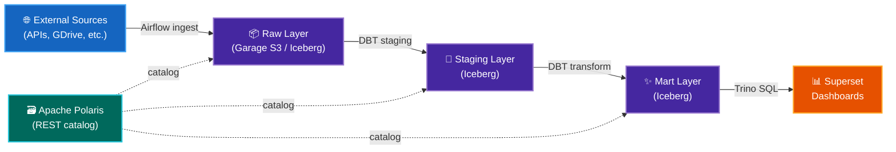
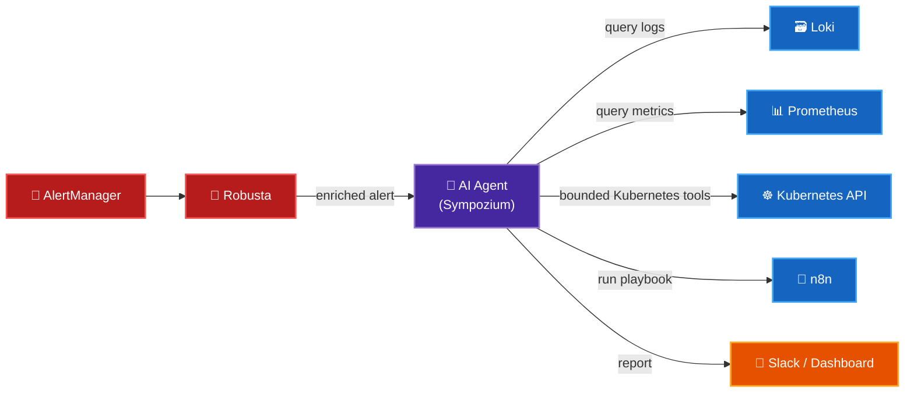

# Roadmap

What's coming next for DataHub.local — completed work is listed first, followed by active work and ideas for what comes next.

---

| Item                              | Details                                                                                                                    |
| --------------------------------- | -------------------------------------------------------------------------------------------------------------------------- |
| Homelab hardware & physical setup | Mixed ARM64/AMD64 cluster in a MicroATX case; CyberPower UPS; HORACO 2.5GbE managed switch                                 |
| K3s Kubernetes cluster            | 7-node heterogeneous cluster with GitOps, Longhorn, Traefik, cert-manager, Tailscale, gVisor, and multiple runtime classes |
| Core services (GitOps)            | ArgoCD ApplicationSet pipeline; encrypted secrets; Velero + Kopia backups; SSO via Dex                                     |
| Data Lakehouse Infra              | Trino + Apache Polaris + Garage S3 + CloudNative PostgreSQL + Apache Spark                                                 |
| Streaming infrastructure          | Redpanda 3-broker cluster (Kafka-compatible)                                                                               |
| Local and agentic AI              | Ollama + Open WebUI, Sympozium autonomous ensembles, and Prometheus/Kubernetes MCP tooling                                 |
| AI automation                     | n8n with AI nodes, LinkedIn Professional Visibility, and AI Diagram Generation                                             |
| Observability stack               | Prometheus + Grafana + Loki + Promtail + Robusta + AlertManager; 20 ServiceMonitors                                        |
| Open source publishing            | [spark-apps-helm, garage-helm, servarr, node-exporter-textfiles, ollama-metrics](open-source/index.md)                     |

---

## ✅ Completed

### :material-robot-happy: AI-Powered Personal AI (n8n + LLMs)

**Completed:** Automated repetitive personal tasks using n8n AI nodes and LLM integrations.

| AI capability          | Description                                                                                             | Status |
| ---------------------- | ------------------------------------------------------------------------------------------------------- | ------ |
| 📰 Content post updater | Pull trending topics from Commafeed + Google Trends MCP → generate an updated version of posts to share | ✅ Done |

---

### :material-table-arrow-right: Data Lakehouse — DBT + dlt + Iceberg

**Completed:** Replaced ad-hoc Airflow transformations with [DBT](https://www.getdbt.com/) models and [dlt](https://dlthub.com/) ingestion/export pipelines.

DBT provides version-controlled, tested SQL transformations, while dlt handles ingestion and reverse-ETL integration around the Iceberg lakehouse.

---

### :material-robot: Move to Claude — AI-Assisted Development

**Completed:** Adopted Claude as the primary AI assistant across the project for documentation, coding, repository management, and operations.

- Claude Code is used for coding tasks and documentation updates
- DataHub.local repositories are being standardised with `CLAUDE.md` guidance
- Reusable workflows cover deployment, linting, review, and documentation maintenance

---

### :material-receipt-text: Invoice Service — Personal Spending Intelligence

**Completed:** Built a real-time pipeline that ingests supermarket invoices, stores structured data in Iceberg, transforms it with DBT, and integrates ingestion/export with dlt.

**How it works:**

1. **Ingestion** — fetch invoice emails from Spanish supermarkets (Mercadona, Lidl, etc.) or extract receipts from Google Photos via OCR
2. **Storage** — parse and store structured line-item data in the Iceberg data lake
3. **Transformation** — DBT models aggregate spend by category, product, and store over time
4. **Notifications** — send a weekly digest via n8n with highlights like:
    - 💸 Current month spend by category
    - 📈 Products whose price has risen the most
    - 🛒 Shopping pattern changes vs. previous months

---

### :material-robot-excited: AI Agents — Sympozium

**Completed:** Three active ensembles (`homelab-ops`, `homelab-responder`, and `homelab-reviewer`) run in `automation`, with permissions, sandboxing, evaluation, and human approval boundaries implemented.

---

## 🔄 In Progress

### :material-server-network: MCP Servers for AI Tooling

**Status:** In progress. The first implementation is available in `datahub-local-ai/agents/mcp`, with Prometheus and Kubernetes-backed homelab facts tools. The next step is to expand coverage and keep all mutating operations behind explicit policy and approval checks.

| Server           | Exposes                                              |
| ---------------- | ---------------------------------------------------- |
| `mcp-prometheus` | Query metrics, inspect alerts, get service health    |
| `mcp-loki`       | Search logs, tail pod output, find errors            |
| `mcp-kubernetes` | List / describe / restart workloads safely           |
| `mcp-trino`      | Run SQL queries against the data lakehouse           |
| `mcp-polaris`    | Browse Iceberg catalog, list tables, inspect schemas |
| `mcp-garage`     | List buckets / objects, check storage usage          |

## 📋 Next

Additional platform and AI capabilities will be added as they are designed, implemented, tested, and validated against the live cluster.

More soon…
