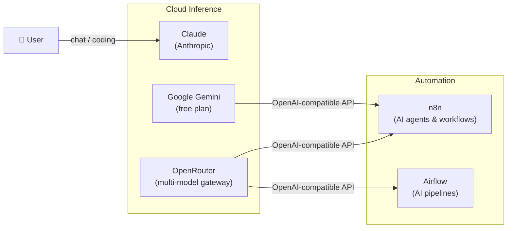

# AI Services

DataHub.local uses a **hybrid cloud AI strategy** — two complementary providers cover different use cases, keeping costs under control without compromising capability.

| Use case | Provider |
|---|---|
| **Interactive chat & coding assistant** | Claude (Anthropic) |
| **Agents & automated workflows** | Gemini (free plan) + OpenRouter |

---

## Stack Overview

---

## Services

### :simple-anthropic: [Claude](https://claude.ai)

llm chat coding-assistant cloud

Primary AI assistant for interactive use: chat, pair programming, document analysis, and ad-hoc reasoning. Claude covers all interactive use cases via Claude.ai and Claude Code (CLI). It replaces what Open WebUI + Ollama would have done locally, with significantly better quality and no infrastructure overhead. Models: Claude Sonnet (default), Opus for complex tasks.

---

### :material-google: [Google Gemini](https://aistudio.google.com/)

llm agents cloud free-tier

Gemini's free plan handles the bulk of agent workloads in n8n — email summarisation, news digests, document processing, and similar high-volume, low-sensitivity tasks. The OpenAI-compatible endpoint (`https://generativelanguage.googleapis.com/v1beta/openai/`) means standard n8n AI nodes work without any custom integration. Models used: Gemini 2.0 Flash, Gemini 1.5 Flash.

---

### :material-swap-horizontal: [OpenRouter](https://openrouter.ai/)

llm gateway multi-model cloud

Multi-model gateway used as overflow and fallback when Gemini free-tier limits are hit. The **Banana routing tier** keeps per-token spend predictable. A single API key, built-in budget caps, and a unified OpenAI-compatible endpoint make it easy to swap between Gemini direct and OpenRouter without changing any workflow logic.

**Why OpenRouter alongside direct Gemini?**

- Hard budget caps prevent surprise spend
- Seamless fallback — same model family, no prompt changes needed
- Single key covers multiple model families if requirements grow

---

### :material-robot-happy: [n8n AI Agents](https://n8n.io/)

ai-agents automation llm workflows

n8n hosts all AI agent workflows, combining AI nodes (AI Agent, OpenAI → Gemini/OpenRouter, LangChain, embeddings, vector stores) with real-world integrations. Workflows are stored in [datahub-local-workflows/n8n/](https://github.com/datahub-local/datahub-local-workflows).

**Example workflows:**

- 📧 **Email summarisation** — classify and summarise incoming emails
- 📰 **News digest** — fetch RSS feeds (via CommaFeed), summarise, send daily briefing to Slack
- 📄 **Document processing** — extract structured data from PDFs using LLM + regex
- 🔔 **Alert enrichment** — take Prometheus alerts, query Loki for logs, generate root cause hypotheses
- 🏠 **Home automation** — integrate with Home Assistant events and produce natural-language status reports
