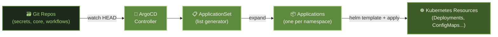

# Automation Services

The automation layer handles GitOps-driven deployment, workflow automation, and backup/recovery. It ensures the cluster is self-healing, continuously deployed from Git, and protected against data loss.

---

## Services

### :material-source-branch: [ArgoCD](https://argo-cd.readthedocs.io/)

gitops kubernetes deployment continuous-delivery

ArgoCD is the engine of the GitOps pipeline. It watches all repositories (`datahub-local-secrets`, `datahub-local-core`, `datahub-local-workflows`) and continuously reconciles the cluster state to match Git. SSO is integrated via Dex OIDC.

**Key patterns used:**

- **ApplicationSet** with list generators — one ApplicationSet generates one Application per namespace (data, monitoring, security, automation, etc.)
- **Server-side apply** — avoids field ownership conflicts with Helm
- **Automated sync** — commits to `HEAD` trigger immediate reconciliation
- **Namespace creation** — ArgoCD creates namespaces if they don't exist

---

### :material-robot: [n8n](https://n8n.io/)

automation workflows low-code integration

n8n is a self-hosted alternative to Zapier/Make. Workflow definitions are stored in [datahub-local-workflows/n8n/](https://github.com/datahub-local/datahub-local-workflows). Components: main app, worker, webhook server, Redis queue, and PostgreSQL for metadata.

**Core use cases:**

- **Personal automation** — connecting Gmail, Google Calendar, Notion, Slack
- **AI workflows** — calling external LLMs, processing documents, generating summaries
- **Data ingestion** — pulling from APIs and feeding into Garage S3 or PostgreSQL
- **Alerting** — custom notification pipelines from Prometheus alerts

n8n supports a growing library of AI-native nodes, making it an ideal platform for building LLM-powered automations without writing code.

#### Active Workflows

**:material-linkedin: LinkedIn Professional Visibility**

Automatically publishes updates to LinkedIn whenever a new blog post, project release, or significant change is pushed to the datahub-local repositories. The workflow:

1. Watches GitHub webhooks for new commits / releases on the datahub-local org
2. Extracts the relevant change (new docs page, new Helm chart version, new open-source release)
3. Uses an LLM to draft a concise, professional LinkedIn post summarising the update
4. Posts via the LinkedIn API with appropriate hashtags

**:material-vector-line: AI Diagram Generation**

Generates architecture and flow diagrams automatically from plain-text descriptions or code changes:

1. Triggered manually or by a webhook (e.g. a new service added to `datahub-local-core`)
2. Sends the service description or diff to an LLM with a prompt to produce a Mermaid diagram
3. Commits the generated diagram back to the repository or posts it as a comment/message

---

### :material-backup-restore: [Velero](https://velero.io/) + [Kopia](https://kopia.io/)

backup disaster-recovery kubernetes s3

Velero orchestrates Kubernetes-level backups (deployments, configmaps, secrets, PVCs) while Kopia handles the actual data-level backups of persistent volume contents to Garage S3. Together they provide:

- **Scheduled automatic backups** — daily snapshots of all namespaces (`automation`, `data`, `media`, `monitoring`, `security`, `other`)
- **Point-in-time restore** — recover any namespace to a previous state
- **Cross-cluster portability** — backups can be restored to a fresh cluster
- **Incremental backups** — Kopia's deduplication keeps storage usage minimal
