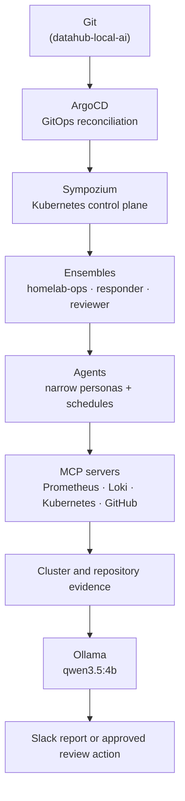
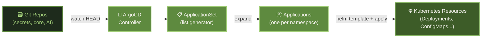

# Automation Services

The automation layer handles GitOps-driven deployment, workflow automation, and backup/recovery. It ensures the cluster is self-healing, continuously deployed from Git, and protected against data loss.

---

## Architecture

Automation is layered rather than being one autonomous service:

`datahub-local-ai` contains the prompts, memory seeds, MCP server, and
Sympozium Helm release. ArgoCD deploys that release into `automation`.
Sympozium then creates the agent runs from the ensemble definitions. Each agent
is intentionally narrow: it asks one operational question, gathers evidence
through a small tool surface, and emits a report in a fixed format.

### Agents and ensembles

The current AI monitoring fleet is organised as follows:

| Ensemble            | Purpose                                             | Boundary                                            |
| ------------------- | --------------------------------------------------- | --------------------------------------------------- |
| `homelab-ops`       | SRE, endpoint, database, cleanup, and GitOps checks | Read-only operational investigation                 |
| `homelab-responder` | Human-facing response to selected homelab findings  | Separate response policy and context                |
| `homelab-reviewer`  | Renovate and repository review                      | Isolated write capability for pull-request comments |

An ensemble is not a single large agent. It is a set of scheduled personas that
share only the memory and tools explicitly configured for that ensemble. This
keeps failures, permissions, and noisy prompts isolated.

### Limitations and safety boundaries

The proactive layer is useful, but it is not an autonomous administrator:

- **Context size is finite.** The local model has a 65,536-token context window,
    but tool schemas and accumulated tool results consume that budget before the
    final report is generated. Narrow tool allowlists, short tasks, and focused
    personas are therefore more reliable than exposing every Grafana or
    Kubernetes operation.
- **The model is small.** `qwen3.5:4b` is fast and local, but it may guess tool
    names, misread unfamiliar metrics, or over-generalise from incomplete data.
    Prompts must name verified metric names and tool arguments, and agents must
    escalate missing data instead of inventing evidence.
- **Runs share one GPU.** Ollama keeps one resident model on the RTX 3060M and
    serves one request at a time. Schedules are staggered; applying an ensemble
    can still trigger multiple immediate runs, so repeated applies can create a
    queue and long report latency.
- **Agents cannot execute an arbitrary sandbox.** The hardened Agent Sandbox
    policy uses gVisor and rejects unsupported runtime classes, shell execution,
    local file writes, delegation, and subagents. Agents act through explicitly
    allowlisted MCP tools, not unrestricted `kubectl`, shell, or code execution.
- **Write actions are isolated.** The normal operations ensemble is read-only.
    The reviewer is separated because it owns the fleet's limited write action:
    adding a GitHub pull-request comment. Mutating cluster actions require an
    explicit policy decision and should not be inferred from a report.
- **Memory is seeded, not continuously reconciled.** Editing a seed in Git does
    not update a running agent's memory ConfigMap. Memory changes require the
    repository's reseed procedure and verification against the next `AgentRun`.
- **Alerts remain the source of detection.** Sympozium enriches and correlates
    evidence; it does not replace Prometheus rules, AlertManager routing, or
    Robusta enrichment. A missing metric or broken MCP tool must be reported as
    uncertainty, not as a healthy result.

## Services

### :material-source-branch: [ArgoCD](https://argo-cd.readthedocs.io/)

gitops kubernetes deployment continuous-delivery

ArgoCD is the engine of the GitOps pipeline. It watches `datahub-local-secrets`, `datahub-local-core`, `datahub-local-ai`, and workflow repositories, and continuously reconciles the cluster state to match Git. SSO is integrated via Dex OIDC.

**Key patterns used:**

- **ApplicationSet** with list generators — one ApplicationSet generates one Application per namespace (data, monitoring, security, automation, etc.)
- **Server-side apply** — avoids field ownership conflicts with Helm
- **Automated sync** — commits to `HEAD` trigger immediate reconciliation
- **Namespace creation** — ArgoCD creates namespaces if they don't exist

---

### :material-robot: [n8n](https://n8n.io/)

automation workflows low-code integration

n8n is a self-hosted alternative to Zapier/Make. Workflow definitions are stored in [datahub-local-workflows/n8n/](https://github.com/datahub-local/datahub-local-workflows). Components: main app, worker, webhook server, Redis queue, and PostgreSQL for metadata.

**Core use cases:**

- **Personal automation** — connecting Gmail, Google Calendar, Notion, Slack
- **AI workflows** — calling external LLMs, processing documents, generating summaries
- **Data ingestion** — pulling from APIs and feeding into Garage S3 or PostgreSQL
- **Alerting** — custom notification pipelines from Prometheus alerts

n8n supports a growing library of AI-native nodes, making it an ideal platform for building LLM-powered automations without writing code.

#### Active Workflows

**:material-linkedin: LinkedIn Professional Visibility**

Automatically publishes updates to LinkedIn whenever a new blog post, project release, or significant change is pushed to the datahub-local repositories. The workflow:

1. Watches GitHub webhooks for new commits / releases on the datahub-local org
2. Extracts the relevant change (new docs page, new Helm chart version, new open-source release)
3. Uses an LLM to draft a concise, professional LinkedIn post summarising the update
4. Posts via the LinkedIn API with appropriate hashtags

**:material-vector-line: AI Diagram Generation**

Generates architecture and flow diagrams automatically from plain-text descriptions or code changes:

1. Triggered manually or by a webhook (e.g. a new service added to `datahub-local-core`)
2. Sends the service description or diff to an LLM with a prompt to produce a Mermaid diagram
3. Commits the generated diagram back to the repository or posts it as a comment/message

---

### :material-backup-restore: [Velero](https://velero.io/) + [Kopia](https://kopia.io/)

backup disaster-recovery kubernetes s3

Velero orchestrates Kubernetes-level backups (deployments, configmaps, secrets, PVCs) while Kopia handles the actual data-level backups of persistent volume contents to Garage S3. Together they provide:

- **Scheduled automatic backups** — daily snapshots of all namespaces (`automation`, `data`, `media`, `monitoring`, `security`, `other`)
- **Point-in-time restore** — recover any namespace to a previous state
- **Cross-cluster portability** — backups can be restored to a fresh cluster
- **Incremental backups** — Kopia's deduplication keeps storage usage minimal

### :material-robot-excited: Sympozium

Sympozium runs the active autonomous agent ensembles in `automation`. Its current production-facing groups are `homelab-ops`, `homelab-responder`, and `homelab-reviewer`. They are delivered from `datahub-local-ai` and use Kubernetes, Prometheus, Loki, and repository context through bounded MCP tools and scheduled tasks.
