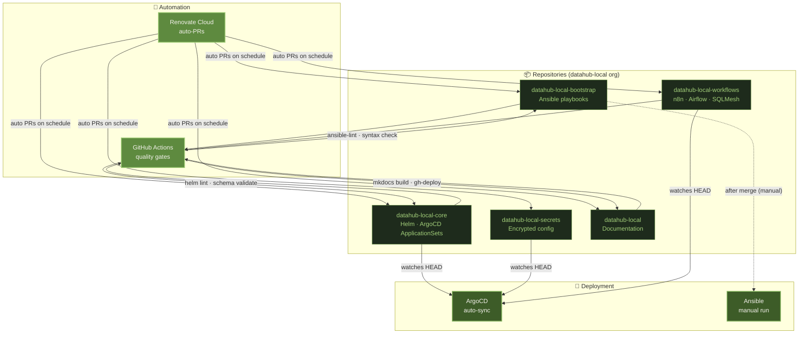

# CI/CD

The CI/CD layer enforces quality gates on every change, keeps all dependencies up-to-date automatically, and delivers the docs site without manual intervention. It sits entirely outside the cluster — hosted by GitHub and Renovate Cloud — and feeds into ArgoCD for the final deployment step.

---

## Architecture



---

## Services

### :simple-github: [GitHub](https://github.com/datahub-local)

<div class="svc-tags"><span class="svc-tag">source-control</span> <span class="svc-tag">git</span> <span class="svc-tag">collaboration</span> <span class="svc-tag">devops</span></div>

Central source of truth for every part of the platform. The organisation is split into focused repositories following a layered deployment model — each layer only depends on the one below it.

```
bootstrap  →  secrets  →  core  →  workflows
```

| Repository | Role | Deployed by |
|---|---|---|
| [datahub-local](https://github.com/datahub-local/datahub-local) | Documentation site (this site) | GitHub Actions → GitHub Pages |
| [datahub-local-bootstrap](https://github.com/datahub-local/datahub-local-bootstrap) | Ansible playbooks — OS provisioning, K3s install, ArgoCD bootstrap | Manual `ansible-playbook` run |
| [datahub-local-secrets](https://github.com/datahub-local/datahub-local-secrets) | Encrypted secrets and private config | ArgoCD (manual sync) |
| [datahub-local-core](https://github.com/datahub-local/datahub-local-core) | Helmfile ApplicationSets — all platform services | ArgoCD (manual sync) |
| [datahub-local-workflows](https://github.com/datahub-local/datahub-local-workflows) | n8n flows, Airflow DAGs, SQLMesh models | ArgoCD (manual sync) |

All changes flow through pull requests, providing a full audit trail before anything reaches the cluster or production environment.

---

### :material-rocket-launch: [GitHub Actions](https://github.com/features/actions)

<div class="svc-tags"><span class="svc-tag">ci-cd</span> <span class="svc-tag">automation</span> <span class="svc-tag">testing</span> <span class="svc-tag">deployment</span></div>

Runs quality gates on every pull request and on every merge to `main`. Pipelines are tailored per repository type — nothing lands in `main` without passing its full gate.

| Workload type | Checks applied |
|---|---|
| Python services & DAGs | Linting (`ruff`, `flake8`), unit tests (`pytest`), integration tests |
| Helm charts | `helm lint`, `helm template` dry-run, schema validation |
| Ansible playbooks | `ansible-lint`, syntax check |
| Docker images | Build, push to registry |
| SQLMesh models | Model parse, DAG validation |

---

### :material-refresh-auto: [Renovate Cloud](https://www.mend.io/renovate/)

<div class="svc-tags"><span class="svc-tag">dependency-management</span> <span class="svc-tag">automation</span> <span class="svc-tag">devops</span> <span class="svc-tag">security</span></div>

Keeps every dependency current without manual tracking. Renovate scans all repositories on a schedule and opens a pull request for each detected version bump — packages, container images, Helm chart versions, GitHub Actions, and Python dependencies are all covered.

| Repository | Renovate behaviour |
|---|---|
| `datahub-local` (docs) | PRs created **automatically**; GitHub Actions validates before merge |
| `datahub-local-core` | PRs created **automatically**; Helm lint must pass; ArgoCD **auto-syncs** after merge |
| `datahub-local-secrets` | PRs created **automatically** |
| `datahub-local-workflows` | PRs created **automatically**; pipeline validation must pass; ArgoCD **auto-syncs** after merge |
| `datahub-local-bootstrap` | Renovate PRs created **automatically**, but the Ansible playbook must be **run manually** after merge |

!!! info "ArgoCD auto-sync: applies resources, skips deletions"
    ArgoCD **auto-sync is enabled** — commits to watched repositories are reconciled to the cluster automatically. However, auto-sync deliberately **excludes prune**: resources that no longer exist in Git are not automatically deleted. Removing a service, renaming a Helm release, or any other deletion requires a **manual sync with prune** enabled in the ArgoCD UI.
