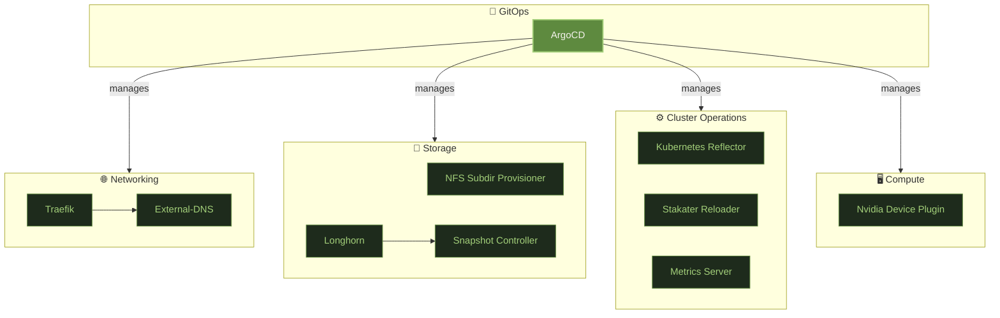

# System

Foundational services bootstrapped by Ansible before GitOps takes over. These run in `kube-system` (or `automation` for ArgoCD) and form the immutable base the rest of the platform builds on.



---

## Storage

### :material-folder-network: [NFS Subdir Provisioner](https://github.com/kubernetes-sigs/nfs-subdir-external-provisioner)

<div class="svc-tags"><span class="svc-tag">kubernetes</span> <span class="svc-tag">storage</span> <span class="svc-tag">nfs</span> <span class="svc-tag">shared-filesystem</span></div>

Bulk shared filesystem backed by the NAS NFS share. Provides a `nfs` StorageClass that dynamically creates subdirectory-per-PVC on the NAS — used for high-capacity workloads that need shared read-write-many access: media libraries, shared config, and high-capacity object storage (Garage S3 runs on this class for its large data volumes).

### :material-harddisk: [Longhorn](https://longhorn.io/)

<div class="svc-tags"><span class="svc-tag">kubernetes</span> <span class="svc-tag">storage</span> <span class="svc-tag">block-storage</span> <span class="svc-tag">csi</span> <span class="svc-tag">high-availability</span></div>

Replicated block storage for stateful workloads that need durability and failover. Longhorn replicates volumes across cluster nodes via CSI, provides snapshot scheduling to S3 (via Kopia), and exposes a web UI for volume inspection. Databases, message queues, and other IOPS-sensitive services use Longhorn PVCs.

### :material-camera: [Snapshot Controller](https://github.com/kubernetes-csi/external-snapshotter)

<div class="svc-tags"><span class="svc-tag">kubernetes</span> <span class="svc-tag">storage</span> <span class="svc-tag">backup</span> <span class="svc-tag">csi</span></div>

Implements the `VolumeSnapshot` Kubernetes API. Works with the Longhorn CSI driver so that `VolumeSnapshot` objects trigger real point-in-time snapshots, consumed by Velero and Kopia for consistent backup pipelines.

---

## Networking

### :material-router-network: [Traefik](https://traefik.io/)

<div class="svc-tags"><span class="svc-tag">kubernetes</span> <span class="svc-tag">networking</span> <span class="svc-tag">ingress</span> <span class="svc-tag">tls</span> <span class="svc-tag">reverse-proxy</span></div>

Ingress controller and reverse proxy running as a DaemonSet on every node. Traefik terminates TLS (certificates from cert-manager), routes traffic via `IngressRoute` resources, and runs OAuth2-Proxy as a `ForwardAuth` middleware so every annotated route passes through SSO before hitting the backend.

### :material-dns: [External-DNS](https://github.com/kubernetes-sigs/external-dns)

<div class="svc-tags"><span class="svc-tag">kubernetes</span> <span class="svc-tag">networking</span> <span class="svc-tag">dns</span> <span class="svc-tag">automation</span></div>

Watches `Ingress` and `Service` resources and automatically upserts DNS A/CNAME records in the configured DNS provider. Adding a new service with the right annotation is enough to get a live public DNS record — no manual DNS management.

---

## Cluster Operations

### :material-content-copy: [Kubernetes Reflector](https://github.com/EmberStack/kubernetes-reflector)

<div class="svc-tags"><span class="svc-tag">kubernetes</span> <span class="svc-tag">operations</span> <span class="svc-tag">secrets</span> <span class="svc-tag">automation</span></div>

Mirrors Secrets and ConfigMaps across namespaces based on annotations. Used to propagate the wildcard TLS certificate and shared credentials (S3 keys, registry pull secrets) from a single source namespace to every consumer without duplication or drift.

### :material-reload: [Stakater Reloader](https://github.com/stakater/Reloader)

<div class="svc-tags"><span class="svc-tag">kubernetes</span> <span class="svc-tag">operations</span> <span class="svc-tag">automation</span> <span class="svc-tag">configuration</span></div>

Watches ConfigMaps and Secrets for changes and automatically triggers rolling restarts of annotated Deployments and DaemonSets. Annotate a workload with `reloader.stakater.com/auto: "true"` and config changes roll out without manual intervention.

### :material-chart-bar: [Metrics Server](https://github.com/kubernetes-sigs/metrics-server)

<div class="svc-tags"><span class="svc-tag">kubernetes</span> <span class="svc-tag">monitoring</span> <span class="svc-tag">autoscaling</span></div>

Aggregates real-time CPU and memory usage from the kubelet on each node. Powers `kubectl top node/pod` and is required by the Horizontal Pod Autoscaler for resource-based scaling decisions.

---

## Compute

### :material-expansion-card: [Nvidia Device Plugin](https://github.com/NVIDIA/k8s-device-plugin)

<div class="svc-tags"><span class="svc-tag">kubernetes</span> <span class="svc-tag">gpu</span> <span class="svc-tag">machine-learning</span> <span class="svc-tag">compute</span></div>

Runs as a DaemonSet and advertises `nvidia.com/gpu` as a schedulable resource on the GPU node. Ollama and other inference workloads request the GPU via `resources.limits` and get exclusive access to it during inference.

---

## GitOps

### :simple-argo: [ArgoCD](https://argo-cd.readthedocs.io/)

<div class="svc-tags"><span class="svc-tag">gitops</span> <span class="svc-tag">kubernetes</span> <span class="svc-tag">deployment</span> <span class="svc-tag">continuous-delivery</span></div>

The single control plane for the entire platform. Bootstrapped last by Ansible, ArgoCD then takes over management of every other service via `Application` and `ApplicationSet` resources pointing at Git repositories. Nothing is applied manually after this point.

```
datahub-local-secrets  →  datahub-local-core  →  per-namespace ApplicationSets
```

Changes flow into the cluster via GitHub and GitHub Actions before ArgoCD picks them up. See the [CI/CD](cicd.md) page for how repositories, quality gates, Renovate, and the deployment pipeline are wired together.
