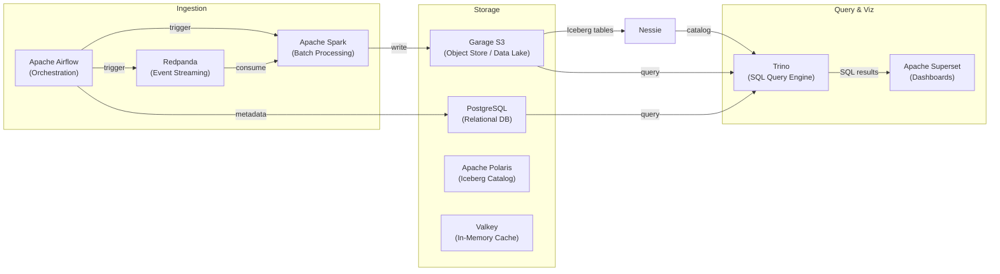

# Data Services

The data stack is the heart of DataHub.local. It provides a complete, end-to-end data platform: ingestion, streaming, storage, transformation, querying, and visualization — all running on the homelab cluster.

---

## Stack Overview

---

## Services

### :material-source-branch: [Apache Airflow](https://airflow.apache.org/)

orchestration data-pipeline python scheduling

Airflow is the orchestration backbone. All data pipeline schedules — ETL jobs, Spark submissions, API pulls — are defined as DAGs in Python and synced via GitSync from the [datahub-local-workflows](https://github.com/datahub-local/datahub-local-workflows) repository. Components: API server, DAG processor, scheduler, triggerer, worker, and a CloudNative PostgreSQL backend.

---

### :material-database-search: [Trino](https://trino.io/)

analytics sql data-lakehouse federated-query

Trino is the query layer of the data lakehouse. It federates queries across all data sources — no ETL needed to join a PostgreSQL table with an Iceberg table stored in Garage S3. Connectors: Iceberg (via Nessie), PostgreSQL, Hive, and S3. Used for ad-hoc analytics and as the backend for Superset dashboards.

---

### :material-chart-bar: [Apache Superset](https://superset.apache.org/)

visualization dashboards analytics bi

Superset provides a self-hosted alternative to Tableau or Looker. Charts, dashboards, and SQL Lab queries connect through the Trino query layer, giving access to the full data lakehouse without leaving the browser. Async workers and a Valkey (Redis-compatible) cache handle heavy query loads.

---

### :material-lightning-bolt: [Redpanda](https://redpanda.com/)

streaming kafka event-driven messaging

Redpanda replaces Kafka with a leaner, faster, single-binary implementation. Used for streaming events between services, ingesting data in real time, and as the backbone for any streaming pipeline. The included Console UI makes it easy to inspect topics and consumer groups. Deployed as a 3-broker cluster.

---

### :material-table: [Apache Polaris](https://polaris.apache.org/)

data-catalog iceberg versioning lakehouse

Nessie acts as the catalog for all Iceberg tables stored in Garage S3. It enables **table versioning** — you can create branches of your data, experiment with transformations, and merge changes back, just like Git. Trino and Spark both connect to Nessie as their Iceberg catalog; PostgreSQL serves as the persistence backend.

---

### :material-database: [CloudNative PostgreSQL (CNPG)](https://cloudnative-pg.io/)

database postgresql kubernetes high-availability

CNPG provides a Kubernetes-native PostgreSQL operator with automatic failover, streaming replication, and backup integration. Multiple PgBouncer connection poolers ensure efficient connection management. Serves as the metadata store for Airflow, Superset config, and the Nessie catalog.

---

### :material-bucket: [Garage (S3-compatible Object Storage)](https://garagehq.deuxfleurs.fr/)

object-storage s3 distributed data-lake

Garage is a lightweight, distributed object storage system. It stores all Iceberg table data, Spark outputs, ML model artifacts, and Velero backups. Compatible with any S3 client — boto3, Spark S3A connector, ArgoCD artifacts, etc. Deployed as a 3-node cluster with a web UI.

!!! tip "Custom Helm Chart"
    The [`garage-helm`](../open-source/index.md) chart was developed as part of this project and is published open source.

---

### :material-fire: [Apache Spark](https://spark.apache.org/)

batch-processing big-data data-pipeline python

Spark runs as on-demand jobs via the SparkOperator. Airflow DAGs submit `SparkApplication` resources for heavy batch processing. The Spark S3A connector writes Iceberg-formatted output directly to Garage, with Nessie managing the catalog metadata.

!!! tip "Custom Helm Chart"
    The [`spark-apps-helm`](../open-source/index.md) chart simplifies deploying SparkApplication resources with shared defaults.

---

### :material-memory: [Valkey](https://valkey.io/)

cache redis messaging broker

Valkey is a Redis-compatible open-source alternative (following the Redis license change). It serves as the cache and Celery broker for Superset's async query workers, providing fast in-memory storage without licensing concerns.

---

### :material-cloud-sync: S3-GDrive Gateway

integration google-drive s3 sync

Bridges personal Google Drive storage into the data lake. Syncs files — Google Sheets exports, Drive documents — into Garage S3 so they can be queried via Trino or processed by Airflow DAGs. Enables personal data workflows without manual export steps.
