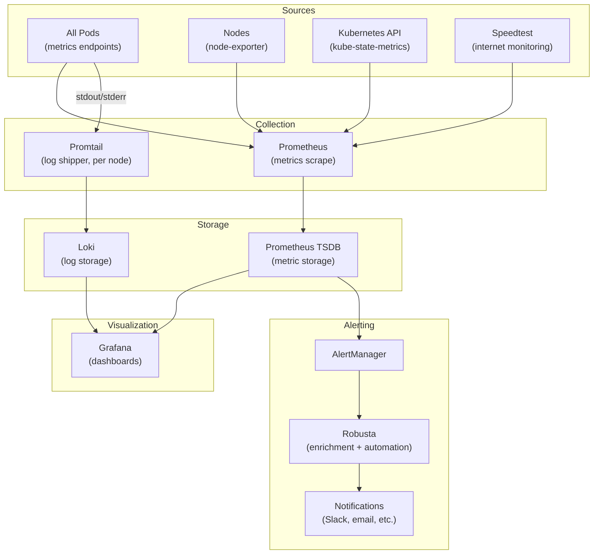
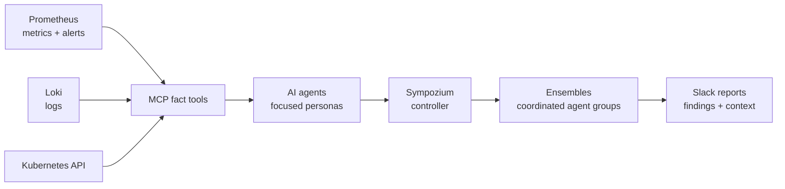

# Monitoring & Observability

The monitoring stack provides full-stack observability: metrics, logs, alerts, and Kubernetes-level automation. Coverage is service-dependent: scrape targets are explicitly discovered through `ServiceMonitor` resources, logs are shipped to Loki, and alert rules are routed through AlertManager.

---

## Stack Overview

---

## Proactive AI Monitoring

The cluster now has a proactive monitoring layer above traditional metrics,
logs, and alert rules. Its purpose is not to replace Prometheus or AlertManager,
but to continuously inspect signals that are difficult to express as a single
rule and provide an operational summary with context.

The execution chain is:

### AI → agents → Sympozium → ensembles

- **AI** — Ollama serves the local `qwen3.5:4b` model on
    `datahublocal-amd-2`. The model provides reasoning, correlation, and concise
    operational summaries.
- **Agents** — each agent is a narrow persona with a specific question,
    schedule, prompt, memory, and allowlisted MCP tools. Examples include the SRE
    sentinel, endpoint warden, database steward, service janitor, and GitOps
    auditor.
- **Sympozium** — the Kubernetes-native control plane that creates and runs the
    agent schedules, injects prompts and memory, applies policy, and delivers
    results.
- **Ensembles** — groups of related agents deployed as Sympozium custom
    resources. The active groups are `homelab-ops`, `homelab-responder`, and
    `homelab-reviewer`, each with a different responsibility and trust boundary.

The result is a second monitoring loop: Prometheus detects measurable conditions;
the AI layer investigates trends, chronic alerts, missing signals, and changes
across nodes and services; Sympozium delivers the resulting report to the
appropriate channel.

---

## Services

### :material-chart-timeline-variant: [Prometheus + AlertManager](https://github.com/prometheus-operator/kube-prometheus-stack)

monitoring metrics alerting time-series

Prometheus runs as one replica in `monitoring` and scrapes node-exporter on all 7 nodes, kube-state-metrics, Kubernetes control-plane targets, and application exporters. The live cluster currently has 20 `ServiceMonitor` resources. AlertManager routes firing alerts through configurable receivers, and targets are discovered via `ServiceMonitor` resources.

**Custom exporters running:**

- `node-exporter-textfiles` — custom metrics collected via shell scripts, exposed as Prometheus textfile format (custom open-source [project](https://github.com/datahub-local/node-exporter-textfiles))
- `ollama-metrics` — transparent Ollama proxy and sidecar exposing token usage, request latency, time-to-first-token, inference speed, model status, and model memory metrics ([open-source project](../open-source/index.md))
- `speedtest-exporter` — periodic internet speed test results as metrics

---

### :material-view-dashboard: [Grafana](https://grafana.com/)

visualization dashboards observability

Grafana provides dashboards for every layer of the stack, with SSO via OAuth2 / Dex OIDC. Data sources: Prometheus (metrics) and Loki (logs).

- **Cluster overview** — node CPU, memory, network, disk (from kube-prometheus-stack defaults)
- **Data services** — Airflow, Trino, Redpanda, PostgreSQL, Spark custom dashboards
- **Application metrics** — per-namespace resource usage
- **Internet performance** — Speedtest results over time

---

### :material-text-box-search: [Loki + Promtail](https://grafana.com/oss/loki/)

logging log-aggregation observability

Promtail runs as a DaemonSet with one pod per node, tailing pod log files and shipping them to Loki with labels (`namespace`, `pod`, `container`). Loki stores logs in Garage S3 for long-term retention. All logs are queryable from Grafana using LogQL. The current Loki deployment is a single stateful Loki pod plus a gateway.

---

### :material-robot-excited: [Robusta](https://robusta.dev/)

alerting kubernetes automation incident-response

Robusta acts as a smart AlertManager webhook receiver. When an alert fires, Robusta:

1. **Enriches it** — attaches pod logs, recent events, resource graphs automatically
2. **Routes it** — sends enriched notifications to Slack/Teams/email with all context
3. **Can remediate** — configured playbooks can automatically restart pods, scale deployments, or run diagnostic commands

This dramatically reduces alert fatigue by providing context alongside every notification.

---

### :material-speedometer: [Speedtest Exporter](https://github.com/MiguelNdeCarvalho/speedtest-exporter)

monitoring network metrics performance

Runs Speedtest CLI periodically and exposes download speed, upload speed, ping, and jitter as Prometheus metrics. Grafana dashboards visualize internet performance trends over time — useful for detecting ISP issues or home network degradation before they affect cluster services.
