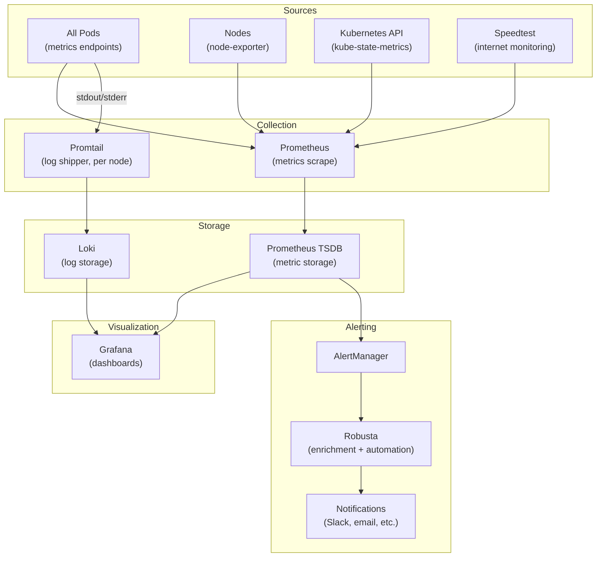

# Monitoring & Observability

The monitoring stack provides full-stack observability: metrics, logs, alerts, and Kubernetes-level automation. Every service in the cluster exposes Prometheus metrics, ships logs to Loki, and is covered by AlertManager rules.

---

## Stack Overview

---

## Services

### :material-chart-timeline-variant: [Prometheus + AlertManager](https://github.com/prometheus-operator/kube-prometheus-stack)

monitoring metrics alerting time-series

Prometheus scrapes metrics from every service that exposes a `/metrics` endpoint, as well as from node-exporter (7 nodes) and kube-state-metrics. AlertManager routes firing alerts through configurable receivers. All scrape targets are auto-discovered via `ServiceMonitor` resources.

**Custom exporters running:**

- `node-exporter-textfiles` — custom metrics collected via shell scripts, exposed as Prometheus textfile format (custom open-source [project](https://github.com/datahub-local/node-exporter-textfiles))
- `speedtest-exporter` — periodic internet speed test results as metrics

---

### :material-view-dashboard: [Grafana](https://grafana.com/)

visualization dashboards observability

Grafana provides dashboards for every layer of the stack, with SSO via OAuth2 / Dex OIDC. Data sources: Prometheus (metrics) and Loki (logs).

- **Cluster overview** — node CPU, memory, network, disk (from kube-prometheus-stack defaults)
- **Data services** — Airflow, Trino, Redpanda, PostgreSQL, Spark custom dashboards
- **Application metrics** — per-namespace resource usage
- **Internet performance** — Speedtest results over time

---

### :material-text-box-search: [Loki + Promtail](https://grafana.com/oss/loki/)

logging log-aggregation observability

Promtail runs on every node as a DaemonSet, tailing all pod log files and shipping them to Loki with labels (`namespace`, `pod`, `container`). Loki stores logs in Garage S3 for long-term retention. All logs are queryable from Grafana using LogQL. Components: Loki (2 pods + gateway), Promtail (DaemonSet — 1 per node).

---

### :material-robot-excited: [Robusta](https://robusta.dev/)

alerting kubernetes automation incident-response

Robusta acts as a smart AlertManager webhook receiver. When an alert fires, Robusta:

1. **Enriches it** — attaches pod logs, recent events, resource graphs automatically
2. **Routes it** — sends enriched notifications to Slack/Teams/email with all context
3. **Can remediate** — configured playbooks can automatically restart pods, scale deployments, or run diagnostic commands

This dramatically reduces alert fatigue by providing context alongside every notification.

---

### :material-speedometer: [Speedtest Exporter](https://github.com/MiguelNdeCarvalho/speedtest-exporter)

monitoring network metrics performance

Runs Speedtest CLI periodically and exposes download speed, upload speed, ping, and jitter as Prometheus metrics. Grafana dashboards visualize internet performance trends over time — useful for detecting ISP issues or home network degradation before they affect cluster services.
