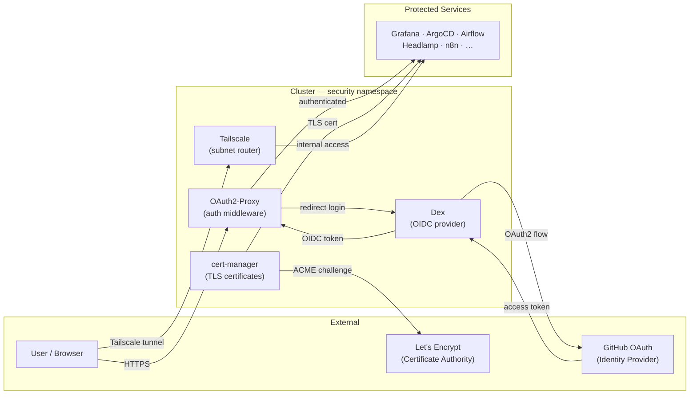

# Security

The security layer provides zero-trust access, certificate management, SSO, and VPN for every service in the cluster. All services are deployed in the `security` namespace via ArgoCD.

---

## Architecture



---

## Services

### :material-certificate: [cert-manager](https://cert-manager.io/)

<div class="svc-tags"><span class="svc-tag">tls</span> <span class="svc-tag">certificates</span> <span class="svc-tag">kubernetes</span> <span class="svc-tag">automation</span></div>

Automates TLS certificate provisioning and renewal via ACME. A wildcard `ClusterIssuer` points to Let's Encrypt (DNS-01 challenge) and covers `*.homelab.alvsanand.com`. Issued certificates are stored as Kubernetes Secrets and automatically mirrored across namespaces by Reflector — every service gets TLS without extra config. Components: Controller, CAInjector, and Webhook.

---

### :material-account-key: [Dex](https://dexidp.github.io/dex/)

<div class="svc-tags"><span class="svc-tag">oidc</span> <span class="svc-tag">authentication</span> <span class="svc-tag">identity</span> <span class="svc-tag">sso</span></div>

OIDC identity provider that federates GitHub OAuth into a standard OpenID Connect endpoint every cluster service can trust. Services register as OAuth2 clients with Dex — none of them needs to know about GitHub directly.

**Auth flow:**

1. User accesses a protected service (e.g. Grafana).
2. Service redirects to Dex (or via OAuth2-Proxy for apps without native OIDC).
3. Dex sends the user to **GitHub** to authenticate.
4. GitHub returns an `access_token`; Dex issues an OIDC `id_token` back to the client.
5. Service validates the token against Dex's JWKS endpoint and grants access.

Group membership from the GitHub organization is passed as OIDC claims and used for RBAC (e.g. Grafana `Admin` role, ArgoCD `admin` group).

---

### :material-shield-lock: [OAuth2-Proxy](https://oauth2-proxy.github.io/oauth2-proxy/)

<div class="svc-tags"><span class="svc-tag">authentication</span> <span class="svc-tag">proxy</span> <span class="svc-tag">sso</span> <span class="svc-tag">security</span></div>

Authentication reverse proxy wired into Traefik as a `ForwardAuth` middleware. Any `IngressRoute` annotated with the auth middleware redirects unauthenticated requests through OAuth2-Proxy → Dex → GitHub, then sets a session cookie on success. Services with no native OIDC support (Longhorn UI, Headlamp, internal tools) get SSO for free with a single annotation.

```
Traefik IngressRoute
  └─ ForwardAuth → oauth2-proxy
       └─ OIDC provider → dex
            └─ Upstream IdP → GitHub OAuth
```

---

### :material-vpn: [Tailscale](https://tailscale.com/)

<div class="svc-tags"><span class="svc-tag">vpn</span> <span class="svc-tag">networking</span> <span class="svc-tag">zero-trust</span> <span class="svc-tag">wireguard</span></div>

Zero-trust VPN mesh running as a subnet router inside the cluster. It advertises the pod and service CIDRs into the Tailnet so any enrolled device (laptop, phone, remote server) can reach internal cluster services by IP — no port-forwarding or public exposure needed. Tailnet ACL policies provide a second layer of access control independent of Kubernetes RBAC.

| Access pattern | How |
|---|---|
| Public services | Traefik + Let's Encrypt (`*.homelab.alvsanand.com`) |
| Admin / internal tools | Tailscale tunnel → cluster service CIDRs |
| Break-glass / kubectl | Direct node access via Tailscale IPs |
